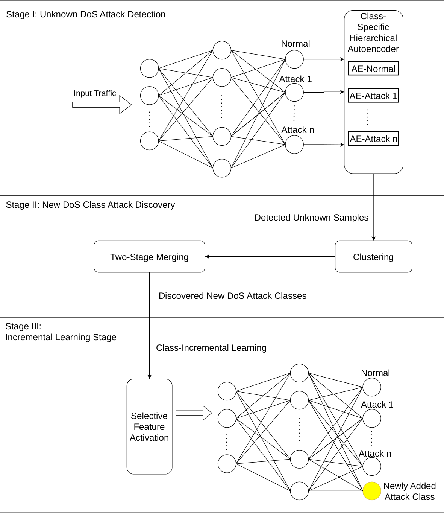
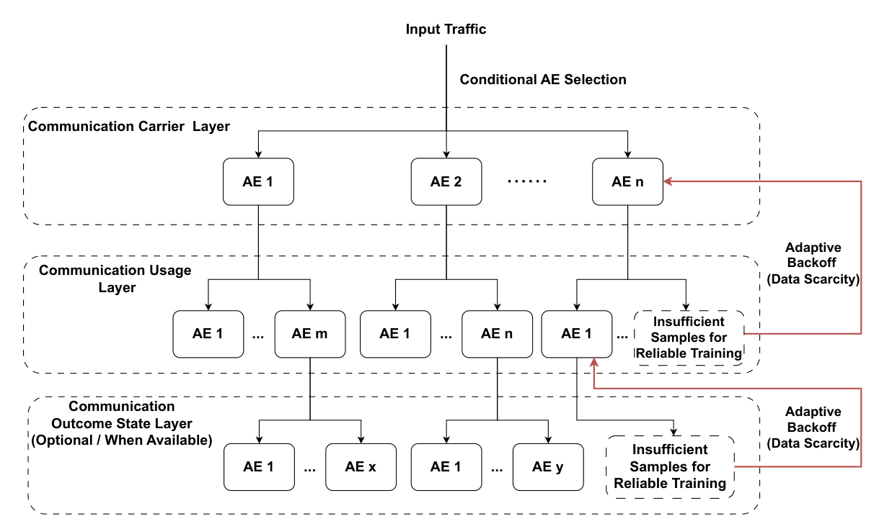
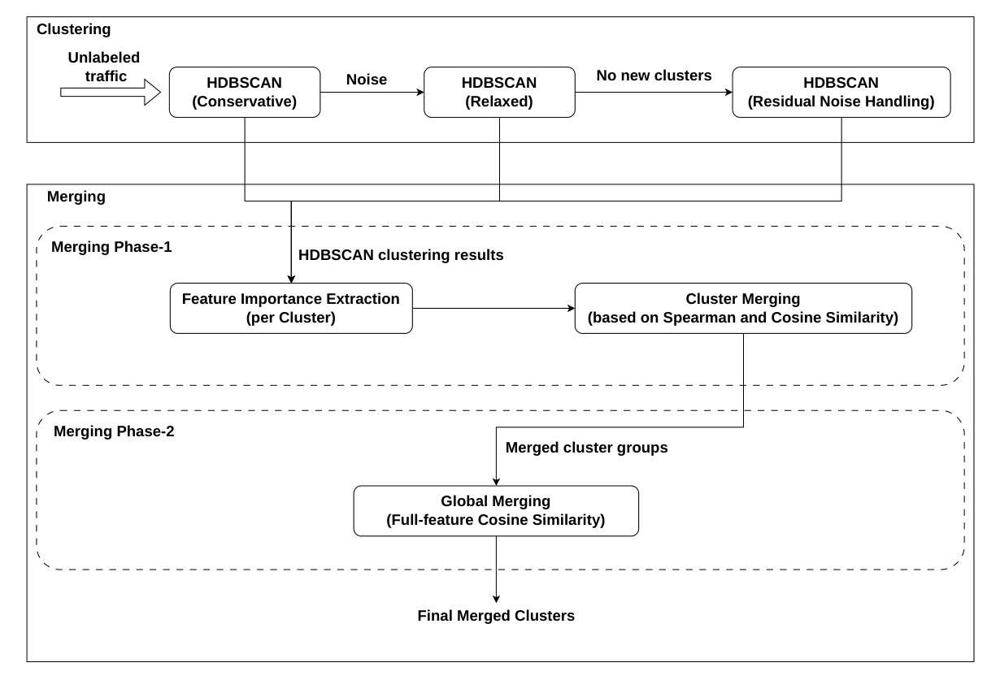
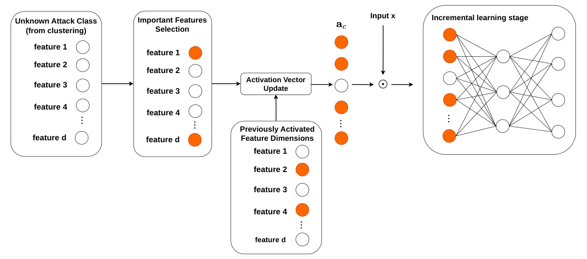
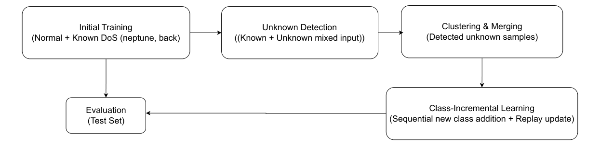
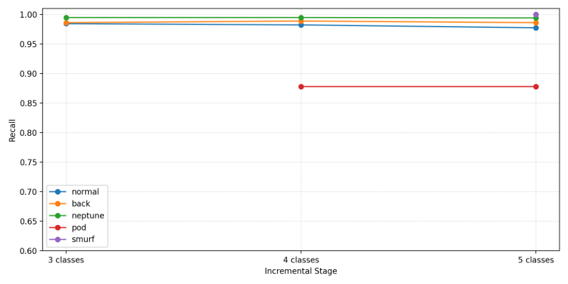

# A Stage-Wise Framework Using Class-Incremental Learning for Unknown DoS Attack Detection

**Juncheng Ge1, Yaokai Feng2,\* and Kouichi Sakurai2**

1 Graduate School of Information Science and Electrical Engineering, Kyushu University, Fukuoka 819-0395, Japan; gjc1105682701@gmail.com or ge.juncheng.748@s.kyushu-u.ac.jp
2 Faculty of Information Science and Electrical Engineering, Kyushu University, Fukuoka 819-0395, Japan; sakurai@inf.kyushu-u.ac.jp
* Correspondence: fengyk@ait.kyushu-u.ac.jp

*Article — Future Internet **2026**, *18*, 145. https://doi.org/10.3390/fi18030145*

| | |
|---|---|
| Received | 27 January 2026 |
| Revised | 8 March 2026 |
| Accepted | 9 March 2026 |
| Published | 12 March 2026 |
| Copyright | © 2026 by the authors. Licensee MDPI, Basel, Switzerland. |

> This article is an open access article distributed under the terms and conditions of the Creative Commons Attribution (CC BY) license.

## Abstract

Denial-of-Service (DoS) attacks remain one of the most dangerous threats in modern Internet environments. They aim to overwhelm networks, servers, or online services with massive volumes of traffic, and maintaining service availability is a core pillar of cybersecurity. More importantly, DoS attack techniques continue to evolve. However, traditional intrusion detection systems (IDS) trained on fixed attack categories struggle to identify previously unknown DoS attack types and cannot dynamically incorporate newly emerging classes. To address this challenge, this study proposes a stage-wise network intrusion detection framework that integrates unknown attack detection, attack discovery, and class-incremental learning into a unified pipeline. The framework consists of three stages. First, an autoencoder-based anomaly detection approach is used to separate potential unknown DoS attack samples from known classes. Second, a clustering-and-merging strategy is applied to the detected unknown DoS samples to discover emerging attack clusters with similar structural characteristics. Third, the classifier architecture is expanded for each newly discovered cluster through a class-incremental learning mechanism, enabling the continual incorporation of new attack classes while maintaining stable detection performance on previously learned classes. Experimental results on the DoS category of the NSL-KDD dataset demonstrate that the proposed stage-wise framework can effectively isolate samples of unknown DoS attacks, accurately aggregate emerging attack clusters, and incrementally integrate newly discovered attack classes without significantly degrading recognition performance on previously learned classes. These results confirm the capability of the proposed framework to handle progressively emerging unknown DoS attacks.

**Keywords:** network intrusion detection system (NIDS); stage-wise framework; class-incremental learning; detection of unknown DoS attacks

---

## 1. Introduction

Intrusion Detection Systems (IDS) are a fundamental component of modern network security infrastructures, aiming to identify malicious activities by analyzing network traffic and system behaviors. Among various network threats, Denial-of-Service (DoS) attacks and their distributed variants remain among the most serious threats to network availability [1]. Signature-based IDS detect intrusions by matching observed traffic patterns against predefined rules or attack signatures. Such systems are highly effective in identifying known attacks with high precision and low false alarm rates [2]. However, their reliance on predefined signatures makes them less effective against unknown DoS attacks, and limits their generalization capability. To address these limitations, machine learning (ML) and deep learning (DL) techniques have been widely introduced into the field of intrusion detection systems (IDS) [3–5].

Unlike rule-based detection approaches that rely on manually crafted signatures and expert-defined features, ML/DL-based methods automatically learn statistical or semantic representations from network traffic data. By modeling complex patterns of diverse attack behaviors, these approaches demonstrate improved generalization performance in dynamic and heterogeneous network environments [6]. Although these approaches improve generalization to unseen variations, most of them focus on binary or coarse-grained classification, providing limited information for threat attribution and response. In practical defense scenarios, especially under advanced persistent threats (APTs), fine-grained attack categorization is crucial for understanding attacker behavior and constructing the attack kill chain [7].

Most existing ML/DL-based intrusion detection systems are developed under a closed-set assumption, where all attack categories are predefined and fixed during training. As a result, these systems often struggle to detect unknown DoS attacks that were not observed during training. Moreover, attack behaviors continuously evolve, and new DoS attack patterns may emerge without prior labels, making it difficult for such systems to adapt to newly emerging threats over time.

To address these challenges, existing studies have explored two related research directions: unknown attack detection and class-incremental learning for intrusion detection systems. Unknown attack detection aims to identify network traffic that deviates from known attack patterns or normal behaviors. Anomaly detection techniques have been widely adopted for this purpose, enabling IDS models to reject or flag unknown attacks [8,9]. Another line of research investigates class-incremental learning for intrusion detection, where models are progressively updated to incorporate new attack categories while preserving performance on previously learned classes [10–12].

Despite recent progress in unknown attack detection and class-incremental learning for intrusion detection systems, several limitations still remain. Many existing studies investigate these two aspects separately or integrate them in a non-systematic manner. Unknown attack detection methods can identify unknown DoS attacks, but they typically provide limited information about the underlying attack categories, making them insufficient to support subsequent model adaptation [13]. Class-incremental learning approaches for intrusion detection systems generally assume that newly emerging DoS attacks are provided with predefined class labels. Moreover, such approaches often rely on static feature representations, making them vulnerable to catastrophic forgetting when new discriminative patterns emerge.

Collectively, a closed-loop pipeline that links unknown DoS attack detection, label-free attack discovery, and continual model updating is still largely missing in existing IDS studies. Consequently, current intrusion detection systems lack a systematic mechanism to both identify unknown DoS attacks and continuously adapt to newly emerging DoS attack patterns. This motivates a unified framework that can detect unknown DoS attacks, discover new DoS attack categories from unlabeled data, and incrementally learn them while accounting for feature evolution.

To address these issues, we propose a stage-wise intrusion detection framework for DoS attacks. The proposed framework unifies unknown DoS attack detection, attack discovery, and class-incremental learning into a structured pipeline, enabling the intrusion detection system to progressively evolve from detecting unknown DoS attacks to incorporating newly discovered attack classes into the model. The main contributions of this work are summarized as follows:

- A stage-wise intrusion detection framework for DoS attacks is proposed, in which unknown DoS attack detection, new DoS attack class discovery, and class-incremental learning are organized into a unified pipeline, enabling structured and progressive model updates.
- A class-specific hierarchical AutoEncoder (AE) architecture is developed to perform semantic-level reconstruction at the communication carrier, usage, and outcome state. This design enables accurate identification of unknown DoS attacks while preserving reliable recognition performance for known attacks. A data-dependent fallback mechanism is further introduced to ensure robust detection when fine-grained subspaces lack sufficient training samples.
- A progressive clustering method with a two-stage merging strategy is proposed to discover potential new DoS attack classes. Cluster similarity is first evaluated within the important-feature subspace using cosine similarity, followed by global consolidation over the full feature space to generate stable and meaningful pseudo labels.
- Selective feature activation is introduced to simulate changes in discriminative patterns within a fixed feature space, and an adaptive loss-weight scheduling strategy is applied to mitigate catastrophic forgetting during class-incremental updates, enabling the model to maintain high recognition performance for both previously known and newly discovered DoS attack classes.
- Experiments are conducted on the DoS category of the NSL-KDD dataset [14] to evaluate the effectiveness of the proposed framework.

The remainder of this paper is organized as follows. Related work is summarized in Section 2. The proposed methodology is presented in Section 3. The experimental setup and evaluation results on the DoS category of the NSL-KDD dataset are reported in Section 4. Finally, conclusions are drawn and directions for future work are outlined in Section 5.

---

## 2. Related Work

Since the work of Sakurada and Yairi [15], AE-based methods have been widely adopted in the field of anomaly detection. These approaches model the distribution of normal data and identify samples with large reconstruction errors as anomalies, thereby enabling effective detection of abnormal behaviors. Building upon this paradigm, Mirsky et al. [9] extended AE-based methods to the intrusion detection system (IDS) scenario by introducing engineering-oriented adaptations to address practical challenges such as high-dimensional network traffic features and online detection requirements. These studies have demonstrated the effectiveness of autoencoders for network anomaly detection. However, most existing AE-based approaches formulate intrusion detection as a binary classification task between normal and anomalous traffic, without explicitly modeling the differences among various attack types within anomalous traffic. This treatment exhibits clear limitations in real-world network environments. When anomalous traffic comprises multiple attack types, such models struggle to further determine whether a detected anomaly corresponds to a known attack category or represents an unknown attack.

To overcome the limitations of conventional anomaly detection in handling unknown classes, some studies have begun to incorporate concepts from open set recognition (OSR) [16]. Unlike closed-set classification, OSR emphasizes the ability to explicitly reject samples from unknown classes during the testing phase, rather than forcing them into one of the known classes [17,18]. Qiu et al. [19] proposed a reconstruction-based unknown attack detection mechanism by training a class-specific variational autoencoder (VAE) for each known intrusion category. Each VAE is optimized to model the data distribution of its corresponding class using only in-class samples. At test time, samples assigned to a known class are reconstructed using the corresponding VAE, and the reconstruction error serves as an anomaly score. A high reconstruction error indicates that the sample does not conform to the learned class-specific distribution, thereby signaling a potential unknown attack. This class-wise autoencoder design enables effective discrimination between known and unknown attacks beyond conventional classifier confidence scores.

Based on the above studies, autoencoders can be considered a mature and flexible tool for anomaly modeling. However, single-stage unknown class recognition remains insufficient to meet the long-term operational requirements of real-world network environments. In practice, attack behaviors are not static and new attack types gradually emerge over time. Therefore, an intrusion detection system should not only identify unknown attacks during detection, but also incrementally acquire new attack knowledge during deployment and continuously extend its capability without requiring complete retraining of the model. Martina et al. explicitly pointed out that network intrusion detection systems (NIDS) require mechanisms capable of continuous learning and gradual adaptation to new attack patterns during runtime [20]. Motivated by this observation, recent research has increasingly focused on introducing incremental learning techniques into open-world intrusion detection.

Incremental learning aims to enable models to sequentially incorporate new data or new classes while preserving previously acquired knowledge, thereby alleviating the problem of catastrophic forgetting. This line of research was initially developed in the field of image recognition, where various strategies have been proposed to mitigate forgetting in classification tasks. These strategies have gradually formed several representative paradigms, including replay-based methods [21], regularization-based approaches [22], and knowledge distillation techniques [23].

Incremental learning is commonly studied as a representative setting within the broader framework of continual learning. De Lange et al. systematically categorized continual learning scenarios into domain-incremental, task-incremental, and class-incremental settings [24]. Among them, class-incremental learning is considered one of the most challenging scenarios, as it requires the model to perform unified classification over an expanding label space without access to explicit task identifiers. This setting closely aligns with the practical requirements of open-world intrusion detection, where new attack types continuously emerge and the system must recognize novel attacks while retaining knowledge of historical ones.

It is worth noting that although incremental learning provides an effective means to address attack evolution in intrusion detection systems, most existing studies focus on closed-set or weakly open-set scenarios [25–27]. Their primary emphasis lies in mitigating catastrophic forgetting when new attack classes are introduced.

While unknown attack detection and incremental learning have each been studied in prior work, they are often investigated under different modeling assumptions and without a unified framework. Recent studies have begun to jointly explore unknown attack detection and incremental adaptation in intrusion detection systems. For example, Farrukh et al. [28] proposed an intelligent and self-sustaining network intrusion detection system (AIS-NIDS) that integrates open-set recognition with incremental learning to autonomously update the detection model when unknown attacks are encountered. This work demonstrates the feasibility of combining unknown detection and incremental learning within a unified system framework.

However, AIS-NIDS primarily treats unknown attacks as a unified stream that triggers subsequent incremental updates, without explicitly modeling the discovery or consolidation of multiple fine-grained attack categories from unlabeled data. Although detection and incremental learning are implemented through multiple functional modules, unknown attack detection mainly serves as a trigger for model updating, and an explicit intermediate discovery stage with structured outputs is not defined. Moreover, the approach focuses on classifier-level adaptation under a fixed feature space, which limits its ability to explicitly model changes in discriminative patterns exhibited by novel attacks within the existing feature space.

In summary, existing studies have made significant progress in unknown attack detection and incremental learning for intrusion detection systems. Recent works have also begun to explore their joint application. However, these approaches typically address these aspects in isolation or integrate them without explicitly modeling the interaction between unknown attack detection, attack category discovery, and class-incremental learning. As a result, a systematic framework that can detect unknown attacks, discover and organize new attack categories from unlabeled data, and incrementally learn them while accounting for feature evolution remains insufficiently explored. This gap motivates the stage-wise framework proposed in this work.

---

## 3. Methodology

### 3.1. Problem Definition

We consider an intrusion detection problem under the DoS attack setting, where the classification model is initially trained on a set of known traffic classes. During deployment, the system is required not only to accurately recognize samples belonging to known classes but also to identify attack samples that do not belong to any previously observed class.

In this setting, traffic patterns that deviate from known classes (including both normal and known DoS attack classes) are regarded as unknown DoS attacks. Such samples should not be forcibly assigned to existing classes, but treated as potential new attack types. As unknown DoS attacks are continuously observed, the model is expected to progressively incorporate them as new attack classes through incremental learning.

Furthermore, with the introduction of new attack types, the discriminative features required to distinguish different DoS attack classes may progressively increase. Therefore, while leveraging newly introduced discriminative features to learn new attack classes, the model is required to preserve the classification capability of previously learned attack classes, thereby mitigating catastrophic forgetting.

### 3.2. Overall Framework

Based on the problem formulation described above, we propose an integrated intrusion detection framework, as illustrated in Figure 1. The proposed framework follows a stage-wise design and consists of three sequential stages.

- **Stage I: Unknown DoS Attack Detection.** In this stage, incoming traffic is first processed by a shared closed-set classifier, where each output node corresponds to a known traffic class and is associated with a class-specific hierarchical autoencoder (described in Section 3.3). Each hierarchical autoencoder is trained to model the distribution of its corresponding known class. Based on reconstruction behavior, samples that deviate from the assigned known-class distribution are flagged as candidate unknown samples.
- **Stage II: New DoS Attack Class Discovery.** In this stage, the detected unknown samples are grouped through a clustering-based discovery process, and similar attack patterns are merged to form candidate new DoS attack classes (described in Section 3.4).
- **Stage III: Class-Incremental Learning.** In this stage, the newly discovered DoS attack classes are gradually incorporated into the classification model through class-incremental learning. During this process, a selective feature activation mechanism is applied to simulate the introduction of new discriminative features brought by newly discovered attack classes. This stage aims to enable the model to learn new attack classes while preserving knowledge of previously learned classes (described in Section 3.5).

**Figure 1.** Overall framework of the proposed system.

In the following subsections, we describe the class-specific hierarchical autoencoder architecture, the clustering-based unknown DoS attack discovery strategy, and the feature-aware class-incremental learning mechanism in detail.

### 3.3. Class-Specific Hierarchical Autoencoder Architecture

This section describes the class-specific hierarchical autoencoder architecture used in Stage I (Unknown DoS Attack Detection). Given a closed-set classifier trained on known classes, the proposed architecture models the class-conditional distribution of each known class. Samples that cannot be adequately reconstructed are flagged as candidate unknown DoS samples and passed to Stage II for discovery.

Even communications belonging to the same semantic category may manifest in diverse forms due to differences in interaction patterns, traffic volume, and execution context. Such intra-class heterogeneity makes it difficult for a single autoencoder to effectively model all variations without compromising representation quality. To address this challenge, we organize autoencoders in a hierarchical and conditional manner, allowing different variants of the same communication type to be modeled by specialized autoencoders rather than being forced into a single representation.

We organize network traffic representations into three semantic layers corresponding to how communication is carried, how it is used, and how it eventually terminates. These layers capture complementary and distinct aspects of communication behavior that are inherently present in real-world networks. Unlike feature-specific designs, the proposed method does not rely on particular dataset fields but reflects fundamental communication semantics.

While real-world network traffic does not always explicitly expose all semantic layers, communication behaviors inherently contain carrier-level information, usage-related patterns, and final outcomes. Depending on data availability and monitoring conditions, these aspects can be explicitly observed or reasonably inferred.

In light of the above analysis, we propose a hierarchical autoencoder architecture. The overall architecture of the proposed method is illustrated in Figure 2. As shown in the figure, the proposed architecture is composed of three semantic layers corresponding to communication carrier, usage, and outcome state semantics. Each semantic layer consists of a set of autoencoders designed to capture heterogeneous manifestation forms within the same semantic category. Autoencoder selection follows a hierarchical and conditional strategy. Selection at a coarser layer constrains the candidate autoencoders at the subsequent finer layer, enabling representations to be progressively refined from coarse-grained communication semantics to finer-grained ones.

**Figure 2.** Hierarchical AutoEncoder Architecture.

The Communication Carrier Layer characterizes the protocol-level carrier on which network traffic is conveyed at the transport layer. Since all network communication must rely on a well-defined transport protocol, different protocols naturally form mutually incompatible communication spaces with distinct structural constraints. As a result, this layer provides a stable and prior coarse-grained semantic partition. Such a partition serves as the foundation for progressively refining higher-level communication semantics while remaining independent of application-specific intent.

Built upon this foundation, the Communication Usage Layer models the application-level purpose of communication, characterizing what the traffic is used for rather than how it is transmitted. Usage semantics reflect the functional intent of communication and abstract service-level meaning from observable traffic behavior, thereby serving as a critical intermediate representation between low-level transport mechanisms and higher-level behavioral outcomes.

Finally, the Communication Outcome State Layer, when available, describes how a communication instance ultimately terminates from the transport-layer perspective, such as successful completion, rejection, or abnormal interruption. Outcome state semantics summarize the result of the communication process and provide complementary evidence for abnormal or malicious behaviors, although such information may not be consistently observable across all network environments or protocols.

Together, these three layers follow the natural lifecycle of network communication and enable progressive semantic abstraction from transmission mechanisms to usage intent and final communication outcomes.

However, as the abstraction progresses toward finer-grained semantic layers, the corresponding representations become increasingly data-dependent, making them vulnerable to sample scarcity in rare or long-tail scenarios. To cope with data scarcity at fine granularity, an adaptive backoff mechanism is incorporated, allowing the architecture to revert to representations learned at a coarser layer when insufficient samples are available.

Based on the above semantic decomposition and robustness considerations, the proposed hierarchical architecture is instantiated in a class-specific manner to support reliable unknown-sample identification.

In the proposed framework, a dedicated hierarchical autoencoder architecture is instantiated for each known class. Each class-specific autoencoder is trained exclusively using samples belonging to that class, enabling it to capture the class-conditional communication semantics across multiple semantic layers. During inference, a test sample is first routed to a predicted known class by the closed-set classifier and then evaluated using the corresponding class-specific hierarchical autoencoder. If the sample cannot be adequately reconstructed, it indicates a mismatch to the learned class-conditional representation and the sample is flagged as an unknown candidate.

### 3.4. Two-Stage Merging Strategy

This subsection presents the two-stage merging strategy employed in Stage II (New DoS Attack Class Discovery) of the proposed framework.

The class-specific hierarchical autoencoders enable the identification of unknown samples that do not conform to any known class distribution. However, merely detecting unknown samples is insufficient for subsequent class-incremental learning, as their category assignments must be further determined. Therefore, a clustering-and-merging process is designed to support the categorization of detected unknown samples.

Before clustering, the detected unknown samples are first organized using a coarse semantic grouping based on their semantic feature representations. This grouping step aims to impose a weak structural constraint on the unknown samples, such that clustering and subsequent merging are performed within and across semantically related groups. Importantly, this semantic grouping does not rely on any label information and serves only as a preprocessing step to facilitate more stable clustering and merging.

In this work, we employ HDBSCAN [29], a density-based hierarchical clustering algorithm to group unknown samples. Unlike traditional clustering methods such as K-Means [30], HDBSCAN does not require a predefined number of clusters and is capable of identifying clusters with varying densities as well as noise samples [31,32]. These properties make HDBSCAN suitable for analyzing complex and imbalanced datasets [33]. In particular, network traffic data often exhibit diverse traffic patterns and severe class imbalance, highlighting the need for more flexible clustering strategies.

Based on the above considerations, a progressive clustering strategy is adopted, as illustrated in Figure 3. Specifically, progressive HDBSCAN clustering is first applied to organize unknown samples into preliminary clusters. The proposed two-stage merging strategy is then performed to further refine cluster structures and obtain the final clustering results.

**Figure 3.** Clustering and two-stage merging strategy.

Unlike applying HDBSCAN in a single pass, the progressive clustering strategy performs clustering in multiple successive passes, where each pass builds upon the results of the previous one. The process starts with a conservative HDBSCAN pass to extract high-confidence core clusters while deliberately leaving ambiguous or low-density samples unassigned. These unassigned samples are then subjected to subsequent HDBSCAN passes with relaxed clustering constraints, allowing additional cluster structures to be discovered from residual noise samples. By progressively relaxing the density requirements, the clustering strategy avoids premature assignments while gradually expanding the coverage of meaningful clusters.

Importantly, clusters identified in earlier passes are preserved and fixed, and subsequent clustering passes operate exclusively on samples that remain unassigned. In this way, the progressive clustering process does not modify existing cluster structures, but instead supplements them by discovering additional clusters from previously unclustered samples. This design ensures both the stability of core clusters and the effective utilization of residual data.

Through this progressive clustering mechanism, the unknown samples are organized into preliminary cluster structures, serving as the input to the subsequent two-stage merging strategy. However, due to heterogeneous traffic patterns and density variations, density-based clustering may lead to cluster fragmentation, where semantically similar samples are divided into multiple clusters. To address this issue, we propose a two-stage merging strategy to further consolidate cluster structures and derive stable and meaningful clusters for unknown sample categorization.

The proposed two-stage merging strategy consists of two phases (Phase-1 and Phase-2). In Phase-1, we perform similarity-based merging on the HDBSCAN clustering results to consolidate clusters with high semantic similarity. For each cluster, a cluster-level representation is constructed based on model-derived feature importance, capturing the relative contribution and ranking of features within the cluster.

Based on these representations, inter-cluster similarity is evaluated using a combination of Spearman rank correlation and cosine similarity. The Spearman rank correlation measures the consistency of feature importance rankings between clusters, while cosine similarity captures directional similarity in the selected feature space. By jointly considering these two complementary similarity measures, clusters exhibiting high similarity are merged to form a set of semantically coherent cluster groups. The objective of this stage is to merge clusters with highly consistent semantic characteristics while preserving cluster purity. Meanwhile, merging semantically similar clusters increases the number of samples within each cluster, thereby enhancing the statistical stability and representativeness.

While Phase-1 focuses on semantic alignment based on importance-derived representations, it operates in a reduced feature space. To further ensure global consistency among the merged clusters, Phase-2 performs refinement using the full feature space. In Phase-2, cosine similarity is computed in the full feature space to further refine the merged clusters obtained from Phase-1. Since semantically consistent clusters have already been consolidated in Phase-1, the cluster-level representations used in this stage are more stable and representative. This enables a more reliable comparison of clusters based on their overall feature distributions.

Considering that the same type of network attack may manifest in multiple forms under different semantic conditions (e.g., varying protocols, services, or connection states), Phase-2 allows clusters with different local semantic characteristics but high global similarity to be merged. As a result, different manifestations of the same underlying attack behavior can be unified into a single cluster. The output of Phase-2 is a set of final merged clusters that are semantically coherent and globally consistent.

Overall, the proposed two-stage merging strategy follows a progressive refinement paradigm, where similarity constraints are gradually relaxed. Phase-1 consolidates clusters with strong semantic consistency to ensure sufficient sample support and stable representations. Phase-2 then performs global refinement using full-feature similarity, merging clusters that remain highly similar across different semantic contexts. This progressive merging process transforms the preliminary clusters generated by HDBSCAN into stable and meaningful structures, providing a reliable foundation for subsequent unknown category assignment and class-incremental learning.

### 3.5. Feature-Aware Class-Incremental Learning Mechanism

This subsection introduces the feature-aware class-incremental learning mechanism employed in Stage III (Class-Incremental Learning) of the proposed framework.

The identification of newly emerging DoS attack types often relies not only on previously utilized feature representations, but also on additional discriminative cues that have not been explicitly modeled or sufficiently exploited before. As a result, it is unrealistic to assume that all effective features are known a priori and remain fixed over time. Under this setting, a key challenge lies in enabling the model to adapt to new DoS attack types while preserving previously acquired knowledge, particularly when the effective feature subspaces vary significantly across different attack categories.

To address this challenge, we propose a Feature-Aware Class-Incremental Learning mechanism, which explicitly incorporates feature-importance information into the class-incremental learning process, thereby enabling the model to progressively expand the effective feature subspace involved in learning while selectively adapting feature-relevant representations, without causing significant interference with previously learned knowledge. Specifically, the proposed mechanism consists of two core components:

1. Selective Feature Activation
2. Adaptive Loss-Weight Scheduling

The details of these two components are presented in the following subsections.

#### 3.5.1. Selective Feature Activation

We first introduce the Selective Feature Activation mechanism, which controls the effective feature subspace involved in each class-incremental learning stage under a fixed input dimensionality.

At the initial stage, the classification model is defined over a fixed global input feature space with dimensionality $d$, which remains unchanged throughout all class-incremental learning stages. Only a subset of features is actively used for training at early stages, while the remaining feature dimensions are kept inactive and set to zero. These inactive dimensions serve as reserved modeling capacity, allowing additional discriminative information to be incorporated in later incremental stages without modifying the model architecture.

Figure 4 illustrates the selective feature activation mechanism under a fixed input dimensionality.

**Figure 4.** Selective Feature Activation.

For each unknown DoS attack class identified through the clustering process, we extract the features that are most relevant for discrimination. Rather than redefining or expanding the input dimensionality, these features are incorporated by activating the corresponding dimensions within the fixed global feature space, enabling them to participate in subsequent incremental training stages while previously activated features are retained.

Formally, let

$$
\mathbf{x} \in \mathbb{R}^d \tag{1}
$$

denote the original input feature vector, where $d$ denotes the feature dimension, and let

$$
\mathbf{a}_c \in \{0, 1\}^d \tag{2}
$$

be the feature activation vector associated with attack class $c$, where each element indicates whether the corresponding feature dimension is activated at the current incremental stage. The feature-aware input representation $\tilde{\mathbf{x}}$ is constructed as:

$$
\tilde{\mathbf{x}} = \mathbf{a}_c \odot \mathbf{x}, \tag{3}
$$

where $\odot$ denotes element-wise multiplication.

In this formulation, features that are not activated at a given stage are set to zero and therefore do not contribute to either forward inference or parameter updates. As a result, these features are functionally excluded from training, while remaining structurally available for future activation. If a feature remains zero throughout all stages, it is equivalent to being absent from the model in terms of training behavior.

This selective activation strategy serves as a modeling abstraction to reflect the realistic scenario in which newly emerging attacks may introduce novel discriminative cues that cannot be assumed to be known in advance. However, while selective feature activation enhances the model's adaptability to newly introduced attacks, it simultaneously increases training instability by continuously altering the effective input subspace. As different feature subsets are dynamically activated across incremental stages, the model operates on an evolving feature space, which exacerbates the conflict between learning new knowledge and preserving previously acquired representations. To address this increased instability, we further introduce an adaptive loss-weight scheduling mechanism.

#### 3.5.2. Adaptive Loss-Weight Scheduling

Most existing class-incremental learning methods employ composite loss functions to balance new-task learning and knowledge preservation. When the input feature space remains stable, existing loss function designs generally achieve good class-incremental learning performance and can effectively mitigate catastrophic forgetting. However, in our setting, selective feature activation continuously alters the effective input subspace as new attacks are introduced, making it increasingly difficult to maintain a stable training process. To address this challenge, we propose an adaptive loss-weight scheduling mechanism that progressively adjusts the contribution of each loss term with training epochs within each class-incremental learning process.

Specifically, the overall training objective consists of several standard loss components and is formulated as:

$$
\mathcal{L} = \mathcal{L}_{\text{new-task}} + \lambda_{\text{replay}}(t)\,\mathcal{L}_{\text{replay}} + \lambda_{\text{KD}}(t)\,\mathcal{L}_{\text{KD}}, \tag{4}
$$

where $\mathcal{L}_{\text{new-task}}$ denotes the classification loss for newly introduced attack samples, $\mathcal{L}_{\text{replay}}$ represents the replay loss computed on previously learned classes, and $\mathcal{L}_{\text{KD}}$ is the knowledge distillation loss used to preserve prior knowledge.

To maintain previously learned representations during incremental training, we adopt a standard knowledge distillation formulation following Hinton et al. [34], based on the Kullback–Leibler divergence between the softened output distributions of the previous and current models:

$$
\mathcal{L}_{\mathrm{KD}} = T^2 \cdot \mathrm{KL}\!\left(\operatorname{softmax}\!\left(\frac{f_{\mathrm{old}}(x)}{T}\right),\ \operatorname{softmax}\!\left(\frac{f_{\mathrm{new}}(x)}{T}\right)\right), \tag{5}
$$

where $\mathrm{KL}$ denotes the Kullback–Leibler divergence, $x$ represents an input sample, $f_{\mathrm{old}}$ and $f_{\mathrm{new}}$ denote the output logits of the previous model and the current model, respectively, and $T$ is the temperature parameter controlling the smoothness of the output distributions. This formulation follows standard practice in knowledge distillation and has been commonly adopted as a knowledge preservation mechanism in class-incremental learning settings.

Although the above loss components are commonly used building blocks in existing methods, their relative importance varies significantly across training epochs under dynamically evolving feature spaces induced by selective feature activation. In particular, enforcing fixed contributions from replay and distillation losses often leads to unstable optimization, either suppressing the learning of newly activated features or exacerbating forgetting of previously learned attacks.

To address this issue, we introduce an epoch-level adaptive loss-weight scheduling strategy within each class-incremental learning process. Formally, the adaptive scheduling strategy is defined as follows:

$$
\lambda_{\mathrm{replay}}(t) = \lambda^{0}_{\mathrm{replay}} \cdot \frac{t}{T_0}, \tag{6}
$$

$$
\lambda_{\mathrm{KD}}(t) = \frac{\lambda^{0}_{\mathrm{KD}}}{t + 1}, \tag{7}
$$

$$
T = T_0 + \alpha \cdot t, \tag{8}
$$

where $t$ denotes the current training epoch within a class-incremental learning process, $\lambda^{0}_{\mathrm{replay}}$ and $\lambda^{0}_{\mathrm{KD}}$ are the initial loss weights, $T_0$ is the initial temperature, and $\alpha$ is a scaling factor controlling the rate of temperature increase.

Specifically, the replay loss weight is gradually increased to progressively reinforce previously learned attacks after initial adaptation to new ones, while the distillation loss weight is gradually decayed to avoid excessive constraints on newly activated features at later training stages. In addition, the temperature parameter in the distillation loss is increased over training epochs, resulting in smoother distillation targets and enabling a transition from strong early-stage constraints to soft regularization in later stages. This joint scheduling strategy allows the model to achieve a stable balance between rapid adaptation to new attacks and robust preservation of previously acquired knowledge under dynamically changing feature spaces.

Together, the proposed feature-aware activation strategy and the adaptive loss-weight scheduling mechanism constitute a unified class-incremental learning framework, enabling stable and effective learning as the feature space evolves over time.

---

## 4. Experiments

NSL-KDD [14] is an improved version of the KDD Cup 1999 [35] dataset, designed to address issues such as redundant records and data imbalance in the original dataset. It is widely used in the field of network intrusion detection and provides a more representative and practical benchmark for evaluation. We conducted experiments on the NSL-KDD dataset and focused on the DoS attack category, which contains multiple attack subclasses with distinct traffic patterns.

Our goal is to validate the proposed framework in a controlled yet challenging setting. Restricting experiments to a single attack category avoids confounding factors introduced by inter-category differences and allows a clearer analysis of unknown attack detection, clustering-based class discovery, and incremental learning behaviors.

The selection of the DoS category for several reasons. First, DoS is the most statistically significant attack family in NSL-KDD, providing sufficient samples to ensure stable training and reliable evaluation. Second, its subclasses exhibit heterogeneous traffic characteristics, which makes it suitable for evaluating intra-class discrimination and clustering quality.

Finally, although contemporary DOS attacks predominantly manifest as Distributed Denial of Service (DDoS), their core behavioral patterns originate from traditional DoS attacks. Moreover, the connection-level statistical features modeled in NSL-KDD are more closely aligned with the characteristics of DoS and early-stage DDoS attacks. Therefore, focusing on DoS allows us to evaluate the proposed framework under a dataset-compatible and controlled setting, while effectively validating its capabilities in unknown attack detection, clustering-based class discovery, and incremental learning.

### 4.1. Experimental Setup

This subsection details the dataset configuration, experimental protocol, implementation environment, and model architectures used in our experiments. Specifically, normal traffic and six DoS attack subclasses, including neptune, back, teardrop, land, pod, and smurf, are considered. Only samples from the training set are used for model training, while the test set is restricted to normal traffic and the selected DoS subclasses for evaluation. The overall experimental protocol is illustrated in Figure 5.

**Figure 5.** Overview of the experimental protocol under the class-incremental open-set intrusion detection setting.

In the initial stage, two DoS attack subclasses, namely neptune and back, are randomly selected as known attacks and used together with normal traffic to train the initial model. A subset of samples from the known classes is retained as replay data. Subsequently, the remaining DoS attack subclasses are treated as unknown DoS attacks and mixed with normal and known-class samples for open-set evaluation. The detected unknown samples are then clustered and merged to form potential new attack classes. Before clustering, the detected unknown samples are first grouped based on their semantic feature representations. Clustering and merging are then performed within each group, followed by an additional cross-group merging step to obtain the final set of discovered attack classes. These newly discovered classes are incrementally incorporated into the model one by one.

After each incremental learning step, a subset of samples from the newly learned class is preserved as replay data, and the model is evaluated using the corresponding test set.

The experiments were conducted on a system equipped with a 12th Gen Intel® Core™ i7 12700H processor running at 2.30 GHz and 16 GB of RAM. The operating system was Windows 11 (version 24H2). The system was also equipped with an NVIDIA GeForce RTX 3060 GPU with 6 GB of dedicated memory. All programs were implemented in Python using Python version 3.11.4. All neural networks were implemented using PyTorch 2.6.0.

The class-specific autoencoder is constructed for each known traffic class. The encoder compresses the input feature vector through fully connected layers with 64, 32, 16, and 8 neurons, producing an 8-dimensional latent representation. The decoder symmetrically reconstructs the input. ReLU activations are used in all hidden layers to introduce nonlinearity.

The classification network is implemented as a fully connected neural network with a three-layer architecture. Specifically, the classifier consists of an input layer, followed by two hidden layers with 64 and 32 neurons, respectively, and an output layer whose dimensionality corresponds to the number of known traffic classes. ReLU activation functions are applied after each hidden layer. During class-incremental learning, the output layer is dynamically expanded to accommodate newly discovered attack classes.

### 4.2. Data Preprocessing

The NSL-KDD dataset contains both categorical and numerical features. Categorical features, including `protocol_type`, `service`, and `flag`, are encoded using integer encoding. All remaining numerical features are standardized to zero mean and unit variance using statistics computed from the training set. The same preprocessing parameters are applied to the test set to avoid data leakage.

In the NSL-KDD setting, `protocol_type`, `service`, and `flag` are used as a concrete instantiation of the proposed semantic grouping strategy. These features naturally reflect protocol-level, service-level, and communication outcome semantics in network traffic and provide a coarse semantic organization of samples prior to autoencoder-based unknown detection and subsequent clustering. This instantiation is specific to the NSL-KDD dataset and does not rely on any label or attack-specific information, nor does it restrict the general applicability of the proposed framework.

The service feature in the NSL-KDD dataset contains a large number of distinct service types. Consequently, constructing a separate autoencoder for each original service type would result in an excessive number of models and significantly increase the overall complexity of the proposed system. To address this issue, service types are grouped according to their functional characteristics and intended usage. The resulting service grouping is provided in Appendix A.

### 4.3. Performance Evaluation Metrics

This section introduces the evaluation metrics used to assess the performance of the proposed framework at different stages, including unknown DoS attack detection, unknown DoS attack clustering, and class-incremental learning. Different metrics are adopted according to the specific objectives of each stage.

To evaluate the effectiveness of the autoencoder-based unknown detection module, we adopt the Known Detection Rate (KDR) and Unknown Detection Rate (UDR) as the primary evaluation metrics. KDR measures the proportion of known samples that are correctly recognized as known, reflecting the model's ability to preserve performance on known traffic. UDR measures the proportion of unknown samples that are correctly identified as unknown, indicating the effectiveness of the model in detecting unknown DoS attacks. The definitions of KDR and UDR are given as follows:

$$
\mathrm{KDR} = \frac{N_{\text{known}\to\text{known}}}{N_{\text{known}}}, \tag{9}
$$

$$
\mathrm{UDR} = \frac{N_{\text{unknown}\to\text{unknown}}}{N_{\text{unknown}}}, \tag{10}
$$

where $N_{\text{known}}$ and $N_{\text{unknown}}$ denote the total numbers of known and unknown samples, respectively, and $N_{a\to b}$ denotes the number of samples belonging to class $a$ that are classified as class $b$.

Together, these two metrics characterize the trade-off between preserving recognition accuracy for known samples and effectively detecting unknown DoS attacks.

After unknown samples are detected, clustering performance is evaluated to assess the quality of the discovered unknown DoS attack classes. Clustering quality is assessed by comparing the number of discovered clusters with the number of ground-truth unknown attack subclasses and by measuring cluster purity. Cluster purity reflects the degree to which samples within a cluster belong to the same ground-truth class and provides an intuitive and interpretable measure of clustering consistency. The purity of each cluster $C_k$ is defined as:

$$
\mathrm{Purity}(C_k) = \frac{\max_j |C_k \cap G_j|}{|C_k|}, \tag{11}
$$

where $C_k$ denotes the set of samples in the $k$-th cluster and $G_j$ denotes the set of samples belonging to the $j$-th ground-truth class.

HDBSCAN is adopted as a baseline clustering method for comparison. All clustering and merging operations are performed on detected unknown samples without using any label information, and ground-truth labels are used only for evaluation.

For the class-incremental learning stage, recall is adopted as the primary evaluation metric. False negatives are generally more critical than false positives, as undetected attacks may lead to severe security consequences. Therefore, recall is used to emphasize the model's ability to correctly detect both previously learned and newly introduced attack classes. Recall is defined as:

$$
\mathrm{Recall} = \frac{TP}{TP + FN}, \tag{12}
$$

where $TP$ and $FN$ denote the numbers of true positives and false negatives, respectively.

Recall is reported on a per-class basis after the completion of each incremental learning stage. In addition to recall values, the numbers of correctly and incorrectly classified samples are also reported to provide a transparent view of classification performance and false alarm behavior.

Together, these metrics provide a comprehensive evaluation of unknown detection capability, clustering quality, and incremental learning performance under the proposed class-incremental open-set intrusion detection setting.

### 4.4. Experimental Results

This section presents the experimental results of the proposed framework on the NSL-KDD dataset, focusing on the DoS attack category. The experiments are designed to evaluate the effectiveness of each stage of the framework, including unknown DoS attack detection, unknown DoS attack clustering, and class-incremental learning. Accordingly, the results are reported and analyzed in a step-by-step manner, following the progressive pipeline of the proposed approach.

#### 4.4.1. Unknown DoS Attack Detection Results

Table 1 reports the per-class unknown detection rates (UDR) for unknown DoS attack subclasses and the known detection rates (KDR) for known classes under different rejection strategies.

**Table 1.** Per-class unknown detection rates (UDR) and known detection rates (KDR).

| | CCT ($t$ = 0.9) | CS-AE | Our Proposal |
|---|---|---|---|
| UDR (land) | 13.33 | 99.90 | 100.00 |
| UDR (pod) | 0.00 | 100.00 | 98.51 |
| UDR (teardrop) | 0.00 | 100.00 | 100.00 |
| UDR (smurf) | 0.00 | 98.26 | 99.51 |
| KDR (normal) | 99.88 | 89.99 | 99.98 |
| KDR (neptune) | N/A | 99.90 | 100.00 |

*Values are in %. CCT: classifier-based confidence thresholding; CS-AE: class-specific autoencoder; N/A: not applicable.*

In our open-set setting, unknown DoS attack samples tend to be absorbed into different known classes. Specifically, most unknown DoS attacks are misclassified as normal traffic, while the land attack is predominantly mapped to the known DoS subclass neptune. Therefore, evaluating rejection performance alone is insufficient, as a high unknown rejection rate may be achieved at the expense of incorrectly rejecting or misclassifying samples from known classes. To address this issue, we jointly report the unknown detection rate (UDR) and the known detection rate (KDR) to assess both unknown rejection capability and reasonable recognition performance on known data.

The classifier-based confidence thresholding (CCT) method shows very limited capability in detecting unknown DoS attacks. Although it maintains a high KDR on normal traffic, its UDR values remain close to zero for most unknown DoS attacks, indicating that classifier confidence alone is insufficient for reliable unknown sample detection.

By contrast, the class-specific autoencoder (CS-AE) substantially improves unknown DoS attack detection, achieving near-perfect UDR values on land, pod, and teardrop attacks. However, this improvement comes at the cost of a noticeable reduction in KDR on known classes, particularly for normal traffic. Many normal samples are incorrectly rejected as unknown, increasing false alarms and contaminating the detected-unknown set, which in turn complicates subsequent discovery and labeling of truly unknown DoS attacks in practical deployment.

The proposed method consistently achieves high UDR values across all unknown DoS attack subclasses while simultaneously maintaining near-perfect KDR on known classes. In particular, the proposed approach successfully detects diverse unknown DoS attacks with UDR values exceeding 98% for all subclasses, while preserving stable acceptance rates for both normal traffic and known attack classes. These results demonstrate that the proposed class-specific hierarchical autoencoder architecture effectively balances unknown detection sensitivity and known-class preservation through semantic routing and adaptive fallback.

#### 4.4.2. Unknown DoS Attack Clustering Results

According to the semantic grouping defined in the data processing stage, unknown samples are first partitioned based on `protocol_type`, `service`, and `flag`, and clustering are performed independently within each group.

Table 2 summarizes the number of clusters and remaining noise rates obtained under different clustering strategies, reported separately for each semantic group. The results are obtained by performing clustering independently within each group.

**Table 2.** Comparison of Cluster Numbers and Remaining Noise Rates.

| Group/Metric | Single-Round | Multi-Round (No Merge) | Multi-Round + Stage-1 Merging |
|---|---|---|---|
| Group 1—Clusters | 5 | 10 | 4 |
| Group 1—Remaining Noise (%) | 10.0 | 0.11 | 0.11 |
| Group 2—Clusters | 0 | 3 | 3 |
| Group 2—Remaining Noise (%) | 100.0 | 11.76 | 11.76 |
| Group 3—Clusters | 7 | 10 | 7 |
| Group 3—Remaining Noise (%) | 11.5 | 1.12 | 1.12 |

As shown in Table 2, single-round clustering exhibits limited capability in discovering coherent structures within semantic groups. In particular, for Group 1 and Group 3, single-round clustering produces a small number of clusters while leaving a considerable portion of samples as noise. For Group 2, single-round clustering fails to identify any valid cluster, resulting in all samples being classified as noise.

By contrast, the multi-round clustering strategy substantially reduces the amount of remaining noise across all groups. For Group 1 and Group 3, the remaining noise rate drops from over 10% to below 1%, indicating that iterative relaxation enables the recovery of latent structures that are not captured by a single conservative clustering pass. Notably, even for Group 2, where single-round clustering completely fails, the multi-round strategy is able to extract several meaningful clusters and significantly reduce the noise ratio.

Applying the proposed Stage-1 merging further reduces cluster fragmentation while preserving the low noise levels achieved by multi-round clustering. This suggests that Stage-1 merging effectively consolidates structurally similar clusters within each semantic group without introducing additional noise. Overall, these results indicate that multi-round clustering combined with Stage-1 merging effectively recovers more complete and stable candidate structures within each semantic group, providing a solid foundation for subsequent cross-semantic merging.

Table 3 reports the purity of each final cluster obtained after the proposed Stage-2 cross-semantic merging for unknown DoS attack samples. Cluster purity is evaluated post hoc using ground-truth labels and is not involved in the clustering or merging process.

**Table 3.** Per-cluster purity after Stage-2 merging.

| Cluster ID | Size | Majority Label | Purity |
|---|---|---|---|
| C1 | 2644 | smurf | 1.000 |
| C2 | 884 | teardrop | 0.998 |
| C3 | 197 | pod | 1.000 |
| C4 | 10 | land | 1.000 |
| C5 | 3 | land | 1.000 |

As shown in Table 3, the proposed cross-semantic merging produces a compact set of final clusters with consistently high purity for unknown DoS attacks. All clusters achieve purity values above 99.8%, with four clusters exhibiting perfect purity. This indicates that the merging strategy does not introduce semantic confusion when integrating candidate clusters derived from different semantic groups within the DoS category.

In addition, high-purity clusters are obtained for both frequent and rare DoS attack patterns. Large clusters corresponding to dominant DoS behaviors maintain near-perfect purity, while small clusters associated with rare DoS attacks also remain highly consistent. This suggests that the proposed merging strategy is capable of preserving semantic coherence across clusters of varying sizes without forcing rare patterns to be absorbed into larger structures.

Overall, these results demonstrate that the proposed Stage-2 merging process can effectively consolidate candidate clusters into semantically consistent final groups for unknown DoS attacks under the current experimental setting, providing empirical evidence for the feasibility of the hierarchical clustering and merging framework in organizing DoS attack patterns.

#### 4.4.3. Class-Incremental Learning Results and Analysis

We adopt a class-incremental learning strategy to sequentially learn clustered attack categories.

Table 4 compares the per-class recall of different learning strategies, including an offline upper-bound model, a commonly used incremental learning baseline based on Learning without Forgetting (LwF) [23] with replay, and the proposed incremental learning method.

The offline model is trained using all available data and achieves strong performance across most DoS attack categories, serving as a reference upper bound. In addition, the LwF + Replay model is included as a commonly used incremental learning baseline, since our method is built upon this framework.

**Table 4.** Per-class Recall Comparison among Offline Upper-bound, LwF + Replay, and the Proposed Incremental Learning Strategy.

| Class | Offline Upper-Bound Recall | (TP/Total) | LwF + Replay Recall | (TP/Total) | Our Proposal Recall | (TP/Total) |
|---|---|---|---|---|---|---|
| normal | 0.9904 | 9618/9711 | 0.9718 | 9437/9711 | 0.9773 | 9491/9711 |
| neptune | 0.9953 | 4635/4657 | 1.0000 | 4657/4657 | 0.9942 | 4630/4657 |
| back | 0.8747 | 314/359 | 0.7326 | 263/359 | 0.9861 | 354/359 |
| pod | 0.9512 | 39/41 | 0.7317 | 30/41 | 0.8780 | 36/41 |
| smurf | 1.0000 | 665/665 | 1.0000 | 665/665 | 1.0000 | 665/665 |

Compared with the offline upper-bound model trained using all available data, the LwF + Replay method maintains near-perfect recall on certain attack categories, such as neptune and smurf, but exhibits noticeable performance degradation on other attack types, indicating the presence of catastrophic forgetting.

In contrast, the proposed incremental learning method exhibits more stable performance across attack categories. It improves recall on certain attack types, such as back and pod, compared with LwF + Replay, while remaining competitive with the offline upper-bound model on other categories.

In particular, we observe that the proposed method achieves higher recall on the back attack category than the offline model. Although the offline upper-bound model is trained using all available data and optimized for overall performance, it does not guarantee optimal recall for every individual attack category.

In our experimental setting, back is an initially known attack category; since the number of attack categories in the initial stage is relatively small, the model is more likely to form a sufficiently well-adapted representation of the back attack feature distribution during early training. As additional attack categories are incrementally introduced, the model must balance learning new categories with maintaining performance on previously learned ones. We find that LwF + Replay exhibits more pronounced performance degradation on the back attack during later incremental stages. In contrast, the proposed method more effectively mitigates such degradation, thereby better preserving the effective representations learned in the initial stage and ultimately achieving higher recall on the back attack.

It is worth noting that two DoS attack types, land and teardrop, are not included in Table 4. In the officially provided test set, these two attack categories contain only 7 and 12 samples, respectively. Although experiments were conducted on them, we observed that the evaluation results exhibit high variance and are therefore not statistically reliable. To avoid drawing potentially misleading conclusions, we exclude these two attack types from the reported experimental results.

Table 5 further compares per-class recall between all-feature incremental learning and the proposed selective feature activation strategy, while Table 6 examines the effect of adaptive loss-weight scheduling on incremental learning performance.

**Table 5.** Per-class Recall Comparison between All-feature and Selective Feature Activation under Incremental Learning.

| Class | All Features Recall | (TP/Total) | Selective Feature Activation Recall | (TP/Total) | Change |
|---|---|---|---|---|---|
| normal | 0.9830 | 9546/9711 | 0.9773 | 9491/9711 | −0.0057 |
| neptune | 0.9994 | 4654/4657 | 0.9942 | 4630/4657 | −0.0052 |
| back | 0.9889 | 355/359 | 0.9861 | 354/359 | −0.0028 |
| pod | 0.8780 | 36/41 | 0.8780 | 36/41 | 0.0000 |
| smurf | 1.0000 | 665/665 | 1.0000 | 665/665 | 0.0000 |

**Table 6.** Impact of Adaptive Loss-weight Scheduling (ALS) on Per-class Recall.

| Class | Without ALS Recall | (TP/Total) | With ALS Recall | (TP/Total) | Change |
|---|---|---|---|---|---|
| normal | 0.9683 | 9403/9711 | 0.9773 | 9491/9711 | +0.0090 |
| back | 0.8273 | 297/359 | 0.9861 | 354/359 | +0.1588 |
| neptune | 0.9981 | 4648/4657 | 0.9942 | 4630/4657 | −0.0039 |
| pod | 0.0000 | 0/41 | 0.8780 | 36/41 | +0.8780 |
| smurf | 1.0000 | 665/665 | 1.0000 | 665/665 | 0.0000 |

In practical intrusion detection systems, the emergence of new attacks often requires the introduction of new discriminative cues or the exploitation of previously underutilized feature information. As these discriminative cues are gradually incorporated, the model's utilization of the feature space may change, potentially disrupting previously learned feature subspaces and leading to catastrophic forgetting.

As shown in Table 5, under the adaptive loss-weight scheduling setting, selective feature activation achieves overall performance comparable to that of all-feature incremental learning. This result indicates that, under a more realistic intrusion detection setting in which discriminative features become progressively available, the proposed selective feature activation strategy can attain detection performance close to that of all-feature incremental learning without incurring a significant performance loss.

In contrast, Table 6 shows that in the later stages of incremental learning, applying selective feature activation without adaptive loss-weight scheduling leads to significant performance degradation on some previously learned attack classes, which is indicative of catastrophic forgetting. Introducing adaptive loss-weight scheduling mitigates this issue, allowing the model to learn new attacks while maintaining stable recognition of existing classes. This indicates that adaptive loss-weight scheduling plays an important role in stabilizing incremental learning when newly introduced attacks lead to changes in the feature subspace, as simulated by selective feature activation.

Figure 6 and Table 7 jointly illustrate the degree of forgetting across different incremental learning stages. As shown in the figure, most attack classes exhibit relatively stable recall trends throughout the incremental process. The detailed per-class recall values reported in Table 7 further confirm that performance degradation, when present, remains limited and within an acceptable range.

**Table 7.** Per-class Recall across incremental learning stages.

| Class | Stage 0 | Stage 1 | Stage 2 |
|---|---|---|---|
| normal | 0.9913 | 0.9822 | 0.9773 |
| back | 0.9861 | 0.9889 | 0.9861 |
| neptune | 0.9906 | 0.9948 | 0.9942 |
| pod | N/A | 0.8780 | 0.8780 |
| smurf | N/A | N/A | 1.0000 |

*Values are in %. N/A: not applicable.*

**Figure 6.** Per-class recall across different incremental learning stages.

Overall, these results demonstrate that the proposed incremental learning strategy effectively mitigates catastrophic forgetting while remaining closely aligned with practical intrusion detection scenarios, achieving stable and reliable performance for DoS attack detection.

### 4.5. Discussion

#### 4.5.1. Discussion on Experimental Results

The experimental results in Section 4.4 suggest that the proposed framework exhibits stable behavior across the key stages of unknown DoS attack handling, including unknown sample detection, clustering and merging, and class-incremental learning. Rather than optimizing individual components in isolation, the framework benefits from the synergistic interaction among these stages.

The effectiveness of unknown DoS attack detection provides a reliable foundation for subsequent clustering, as incorrect rejection or excessive misclassification of known traffic may propagate errors to later stages. Furthermore, the clustering and merging strategy enables the discovery of semantically consistent attack structures, thereby reducing ambiguity during incremental model expansion. In the incremental learning stage, the combination of selective feature activation and adaptive loss-weight scheduling helps preserve previously learned representations while accommodating newly introduced attack patterns.

#### 4.5.2. Comparison of Capabilities with Recent Methods

To further examine how different intrusion detection approaches address the challenges posed by evolving attack behaviors, this subsection provides a capability-level comparison with several recent methods, as summarized in Table 8. Rather than focusing exclusively on detection performance, the comparison emphasizes a set of functional capabilities that are critical for the sustainable deployment of intrusion detection systems in dynamic network environments.

To facilitate a clearer interpretation of the comparison, we briefly describe the meaning of each considered capability. Unknown attack detection refers to the ability of a system to identify attack behaviors that were not observed during training, instead of forcing them into one of the known classes. New attack discovery goes beyond unknown detection and concerns whether the system can further analyze and organize unknown samples into potential new attack types. Model adaptation to new attacks indicates whether the detection model can be updated to recognize newly identified attack types without retraining from scratch.

Feature evolution describes whether the system explicitly models changes in the discriminative feature space induced by the emergence of new attack types. Closed-loop learning refers to an integrated process in which detected unknown attacks are subsequently analyzed, learned, and fed back into the detection system, enabling newly acquired knowledge to continuously improve future detection performance. Catastrophic forgetting mitigation concerns whether the system explicitly addresses the degradation of previously learned knowledge when adapting to new attack types, typically through mechanisms such as replay, regularization, or knowledge distillation.

**Table 8.** Comparison with recent intrusion detection methods.

| Capability | Study [19] | Study [27] | Study [28] | Our Proposal |
|---|---|---|---|---|
| Unknown Attack Detection | Yes | No | Yes | Yes |
| New Attack Discovery | No | No | Limited | Yes |
| Model Adaptation to New Attacks | No | Yes | Yes | Yes |
| Feature Evolution | No | No | No | Yes |
| Closed-loop Learning | No | No | Yes | Yes |
| Catastrophic Forgetting Mitigation | No | Yes | Limited | Yes |

*Yes/Limited/No indicate whether the corresponding capability is explicitly supported, partially addressed, or not considered in the method.*

Based on these definitions, Table 8 compares several recent methods in terms of their coverage of the above capabilities. As can be observed, existing approaches generally focus on specific aspects of the evolving intrusion detection problem, such as unknown attack detection or incremental model adaptation, while leaving other capabilities only partially addressed or unconsidered. In contrast, the proposed framework integrates all the considered capabilities into a unified stage-wise design, enabling a more comprehensive and sustainable handling of evolving attack scenarios.

#### 4.5.3. System Complexity and Deployment Feasibility Analysis

Although the proposed framework consists of multiple components, it is not designed to operate under strict real-time constraints. Most computationally intensive processes, including autoencoder updates, clustering and cluster merging of unknown DoS attacks, and incremental model updates, are performed offline or asynchronously. These update procedures are typically conducted periodically and can also be triggered based on the number of detected unknown samples or observed degradation in model performance. During online deployment, the framework primarily relies on inference operations for attack detection and recognition, making it suitable for intrusion detection systems that can tolerate periodic model updates.

#### 4.5.4. Limitation

This study focuses on the DoS attack category of the NSL-KDD dataset to simulate the behavior of the proposed framework under unknown attack scenarios. Although the framework is designed to be attack-agnostic, its effectiveness on other attack types (such as Probe, R2L, and U2R) as well as on more recent and large-scale intrusion detection datasets has not yet been empirically validated. Therefore, the current experimental results may not fully reflect the generalization performance of the framework across diverse attack scenarios and real-world network environments.

---

## 5. Conclusions and Future Work

### 5.1. Conclusions

In this paper, a stage-wise network intrusion detection framework is proposed to address the continual evolution of DoS attack behaviors in network environments. By jointly addressing unknown DoS attack detection, new DoS attack discovery, and class-incremental learning, the framework enables the progressive integration of newly identified attack types.

Experimental results on the DoS category of the NSL-KDD dataset demonstrate that the proposed class-specific hierarchical autoencoder effectively distinguishes unknown samples from known traffic, leading to improved unknown DoS attack detection performance. Building on this capability, the two-stage merging strategy successfully discovers coherent unknown DoS attack classes with high cluster purity, enabling reliable incremental model updates. Furthermore, the proposed feature-aware class-incremental learning strategy effectively mitigates catastrophic forgetting during model expansion. By combining selective feature activation with adaptive loss-weight scheduling, the model maintains stable performance on previously learned classes while progressively incorporating new DoS attack types.

Despite the effectiveness of the proposed framework under the DoS setting, several limitations remain. The current study is evaluated only on the DoS category of the NSL-KDD dataset, and future work will further validate the framework on more diverse attacks and real-world traffic.

Overall, the results suggest that the proposed framework can effectively support unknown DoS attack detection and class-incremental model expansion in evolving intrusion detection settings.

### 5.2. Future Work

In future work, the proposed framework will be extended and validated on more recent and representative intrusion detection datasets beyond NSL-KDD. While NSL-KDD is employed in this study as a controlled benchmark for methodological evaluation, it does not fully reflect the characteristics of modern network environments. Therefore, future evaluations will include contemporary large-scale datasets with diverse attack scenarios and realistic traffic patterns, with representative examples including CIC-IDS2017, CSE-CIC-IDS2018, and UNSW-NB15. Through experiments on these datasets, the generalization capability, scalability, and robustness of the proposed framework under more practical and evolving attack environments will be systematically investigated.

In addition, attack types that are underrepresented or absent in the current experimental setting will be incorporated under improved evaluation protocols, allowing a more comprehensive assessment of the proposed method in realistic incremental learning scenarios. Furthermore, future work will include systematic comparisons with recent state-of-the-art intrusion detection methods, conducted under consistent experimental settings. Such comparisons will help to more clearly position the proposed framework with respect to existing approaches and to identify its strengths and limitations in comparison with the latest research.

---

## Author Contributions

Conceptualization, J.G.; methodology, J.G. and Y.F.; software, J.G.; validation, J.G.; formal analysis, J.G.; investigation, J.G.; resources, J.G.; data curation, J.G.; writing—original draft preparation, J.G.; writing—review and editing, J.G., Y.F. and K.S.; visualization, J.G.; supervision, Y.F. and K.S.; project administration, J.G., Y.F. and K.S.; funding acquisition, K.S. All authors have read and agreed to the published version of the manuscript.

**Funding:** This research received no external funding.

**Data Availability Statement:** The dataset used in this study are publicly available. The NSL-KDD dataset can be accessed and downloaded from the Kaggle repository at <https://www.kaggle.com/datasets/hassan06/nslkdd> (accessed on 23 January 2026).

**Acknowledgments:** During the preparation of this manuscript, the authors used ChatGPT 5.2 (OpenAI, accessed in December 2025) to assist with language editing and improvement of clarity. The authors have thoroughly reviewed and edited the output and take full responsibility for the accuracy and integrity of the final manuscript.

**Conflicts of Interest:** The authors declare no conflicts of interest.

## Abbreviations

The following abbreviations are used in this manuscript:

| Abbreviation | Meaning |
|---|---|
| AE | Autoencoder |
| DOS | Denial of Service |
| KDR | Known Detection Rate |
| NSL-KDD | Network Security Laboratory Knowledge Discovery and Data Mining |
| NIDS | Network Intrusion Detection System |
| OSR | Open Set Recognition |
| UDR | Unknown Detection Rate |

---

## Appendix A. Service Type Grouping Definition for the NSL-KDD Dataset

This appendix summarizes the service type grouping used in the NSL-KDD experiments. Service types are grouped according to their service purposes. The resulting service grouping is summarized in Table A1.

**Table A1.** Service Type Grouping Definition for the NSL-KDD Dataset.

| Group Name | Service Types | Service Purpose |
|---|---|---|
| web | http, http_2784, http_443, http_8001, gopher, harvest | Web-based services |
| mail | smtp, pop_2, pop_3, imap4, courier, vmnet | Email services |
| ftp | ftp, ftp_data, tftp_u, uucp, uucp_path | File transfer services |
| dns | domain, domain_u, name, hostnames | Name resolution services |
| remote_shell | telnet, ssh, shell, login, klogin, kshell, remote_job, exec, rje, X11 | Remote access and shell services |
| db | sql_net, Z39_50 | Database and information retrieval services |
| interactive | IRC, aol, nnsp, nntp | Interactive and messaging services |
| netbios | netbios_dgm, netbios_ns, netbios_ssn | Windows NetBIOS services |
| rpc | sunrpc, pm_dump | Remote procedure call services |
| icmp | eco_i, ecr_i, red_i, urh_i, urp_i, tim_i | ICMP-related services |
| print | printer | Printing services |
| infra | auth, bgp, csnet_ns, daytime, discard, echo, efs, finger, iso_tsap, ldap, link, mtp, netstat, ntp_u, systat, time, whois, supdup | Infrastructure and management services |
| other | other, private | Miscellaneous or private services |

---

## References

1. Shurman, M.M.; Khrais, R.; Yateem, A.A. DoS and DDoS attack detection using deep learning and IDS. *Int. Arab. J. Inf. Technol.* **2020**, *17*, 655–661.
2. Khraisat, A.; Gondal, I.; Vamplew, P.; Kamruzzaman, J. Survey of intrusion detection systems: Techniques, datasets and challenges. *Cybersecurity* **2019**, *2*, 20. \[CrossRef\]
3. Abdallah, E.E.; Eleisah, W.; Otoom, A.F. Intrusion detection systems using supervised machine learning techniques: A survey. *Procedia Comput. Sci.* **2022**, *201*, 205–212. \[CrossRef\]
4. Hozouri, A.; Mirzaei, A.; Effatparvar, M. A comprehensive survey on intrusion detection systems with advances in machine learning, deep learning and emerging cybersecurity challenges. *Discov. Artif. Intell.* **2025**, *5*, 314. \[CrossRef\]
5. Jangra, R.; Kajal, A. A Review of Deep Learning based Intrusion Detection Systems. In *2023 International Conference on Computing, Communication, and Intelligent Systems (ICCCIS)*; IEEE: Piscataway, NJ, USA, 2023; pp. 1004–1009.
6. Buczak, A.L.; Guven, E. A survey of data mining and machine learning methods for cyber security intrusion detection. *IEEE Commun. Surv. Tutor.* **2015**, *18*, 1153–1176. \[CrossRef\]
7. Cruz, S.; Coleman, C.; Rudd, E.M.; Boult, T.E. Open set intrusion recognition for fine-grained attack categorization. In *2017 IEEE International Symposium on Technologies for Homeland Security (HST)*; IEEE: Piscataway, NJ, USA, 2017; pp. 1–6.
8. Laskov, P.; Christin, S.; Kotenko, I. Intrusion detection in unlabeled data with quarter-sphere support vector machines. In *Detection of Intrusions and Malware & Vulnerability Assessment, GI SIG SIDAR Workshop, DIMVA 2004*; Gesellschaft für Informatik eV: Bonn, Germany, 2004; pp. 71–82.
9. Mirsky, Y.; Doitshman, T.; Elovici, Y.; Shabtai, A. Kitsune: An ensemble of autoencoders for online network intrusion detection. *arXiv* **2018**, arXiv:1802.09089. \[CrossRef\]
10. Karn, R.R.; Kudva, P.; Elfadel, I.M. Learning without forgetting: A new framework for network cyber security threat detection. *IEEE Access* **2021**, *9*, 137042–137062. \[CrossRef\]
11. Oikonomou, C.; Iliopoulos, I.; Ioannidis, D.; Tzovaras, D. A multi-class intrusion detection system based on continual learning. In *2023 IEEE International Conference on Cyber Security and Resilience (CSR)*; IEEE: Piscataway, NJ, USA, 2023; pp. 86–91.
12. Amalapuram, S.J.; Channappayya, S.; Tamma, B.R. Augmented memory replay-based continual learning approaches for network intrusion detection. *Adv. Neural Inf. Process. Syst.* **2023**, *36*, 17156–17169.
13. Chalapathy, R.; Chawla, S. Deep learning for anomaly detection: A survey. *arXiv* **2019**, arXiv:1901.03407. \[CrossRef\]
14. Tavallaee, M.; Bagheri, E.; Lu, W.; Ghorbani, A.A. A Detailed Analysis of the KDD CUP 99 Data Set. In *2009 IEEE Symposium on Computational Intelligence for Security and Defense Applications (CISDA)*; IEEE: Piscataway, NJ, USA, 2009.
15. Sakurada, M.; Yairi, T. Anomaly Detection Using Autoencoders with Nonlinear Dimensionality Reduction. In *Proceedings of the 2nd Workshop on Machine Learning for Sensory Data Analysis (MLSDA)*; Association for Computing Machinery: New York, NY, USA, 2014; pp. 4–11.
16. Ping, G.; Ye, X. Open-set intrusion detection with MinMax autoencoder and pseudo extreme value machine. In *2022 International Joint Conference on Neural Networks (IJCNN)*; IEEE: Piscataway, NJ, USA, 2022; pp. 1–8.
17. Geng, C.; Huang, S.j.; Chen, S. Recent advances in open set recognition: A survey. *IEEE Trans. Pattern Anal. Mach. Intell.* **2020**, *43*, 3614–3631. \[CrossRef\]
18. Fang, J.; Xie, C. Unknown intrusion traffic detection method based on unsupervised learning and open-set recognition. *Sci. Rep.* **2025**, *15*, 17001. \[CrossRef\] \[PubMed\]
19. Qiu, Z.; Zhou, D.; Zhai, Y.; Liu, B.; He, L.; Cao, J. VAEMax: Open-set intrusion detection based on OpenMax and variational autoencoder. In *2024 5th Information Communication Technologies Conference (ICTC)*; IEEE: Piscataway, NJ, USA, 2024; pp. 98–105.
20. Martina, M.R.; Foresti, G.L. A Continuous Learning Approach for Real-Time Network Intrusion Detection. *Int. J. Neural Syst.* **2021**, *31*, 2150060. \[CrossRef\]
21. Rebuffi, S.A.; Kolesnikov, A.; Sperl, G.; Lampert, C.H. iCaRL: Incremental classifier and representation learning. In *2017 IEEE Conference on Computer Vision and Pattern Recognition*; IEEE: Piscataway, NJ, USA, 2017; pp. 2001–2010.
22. Kirkpatrick, J.; Pascanu, R.; Rabinowitz, N.; Veness, J.; Desjardins, G.; Rusu, A.A.; Milan, K.; Quan, J.; Ramalho, T.; Grabska-Barwinska, A.; et al. Overcoming catastrophic forgetting in neural networks. *Proc. Natl. Acad. Sci. USA* **2017**, *114*, 3521–3526. \[CrossRef\]
23. Li, Z.; Hoiem, D. Learning without forgetting. *IEEE Trans. Pattern Anal. Mach. Intell.* **2017**, *40*, 2935–2947. \[CrossRef\]
24. De Lange, M.; Aljundi, R.; Masana, M.; Parisot, P.; Jia, X.; Leonardis, A.; Slabaugh, G.; Tuytelaars, T. A Continual Learning Survey: Defying Forgetting in Classification Tasks. *IEEE Trans. Pattern Anal. Mach. Intell.* **2021**, *44*, 3366–3385. \[CrossRef\]
25. Xu, H.; Wang, Y. A Continual Few-Shot Learning Method via Meta-Learning for Intrusion Detection. In *2022 IEEE 4th International Conference on Civil Aviation Safety and Information Technology (ICCASIT)*; IEEE: Piscataway, NJ, USA, 2022; pp. 1188–1194.
26. Du, L.; Gu, Z.; Wang, Y.; Wang, L.; Jia, Y. A Few-Shot Class-Incremental Learning Method for Network Intrusion Detection. *IEEE Trans. Netw. Serv. Manag.* **2024**, *21*, 2389–2401. \[CrossRef\]
27. Cerasuolo, F.; Bovenzi, G.; Marescalco, C.; Cirillo, F.; Ciuonzo, D.; Pescapé, A. Adaptive Intrusion Detection Systems: Class Incremental Learning for IoT Emerging Threats. In *2023 IEEE International Conference on Big Data (BigData)*; IEEE: Piscataway, NJ, USA, 2023; pp. 3547–3555.
28. Farrukh, Y.A.; Wali, S.; Khan, I.; Bastian, N.D. AIS-NIDS: An intelligent and self-sustaining network intrusion detection system. *Comput. Secur.* **2024**, *144*, 103982. \[CrossRef\]
29. Campello, R.J.G.B.; Moulavi, D.; Zimek, A.; Sander, J. Hierarchical density estimates for data clustering, visualization, and outlier detection. *IEEE Trans. Knowl. Data Eng.* **2015**, *27*, 629–644. \[CrossRef\]
30. MacQueen, J. Some methods for classification and analysis of multivariate observations. In *Proceedings of the Fifth Berkeley Symposium on Mathematical Statistics and Probability*; University of California Press: Oakland, CA, USA, 1967; Volume 1, pp. 281–297.
31. Campello, R.J.; Moulavi, D.; Sander, J. Density-Based Clustering Based on Hierarchical Density Estimates. In *Proceedings of the Pacific-Asia Conference on Knowledge Discovery and Data Mining (PAKDD)*; Springer: Berlin/Heidelberg, Germany, 2013; Volume 7819, pp. 160–172.
32. McInnes, L.; Healy, J.; Astels, S. hdbscan: Hierarchical Density Based Clustering. *J. Open Source Softw.* **2017**, *2*, 205. \[CrossRef\]
33. Fernández, A.; García, S.; Herrera, F. Density-Based Clustering to Deal with Highly Imbalanced Data in Multi-Class Problems. *Mathematics* **2023**, *11*, 4008.
34. Hinton, G.; Vinyals, O.; Dean, J. Distilling the knowledge in a neural network. *arXiv* **2015**, arXiv:1503.02531. \[CrossRef\]
35. Stolfo, S.J.; Fan, W.; Lee, W.; Prodromidis, A.; Chan, P.K. KDD Cup 1999 Data. **1999**. Available online: <http://kdd.ics.uci.edu/databases/kddcup99/kddcup99.html> (accessed on 23 January 2026).

---

**Disclaimer/Publisher's Note:** The statements, opinions and data contained in all publications are solely those of the individual author(s) and contributor(s) and not of MDPI and/or the editor(s). MDPI and/or the editor(s) disclaim responsibility for any injury to people or property resulting from any ideas, methods, instructions or products referred to in the content.
