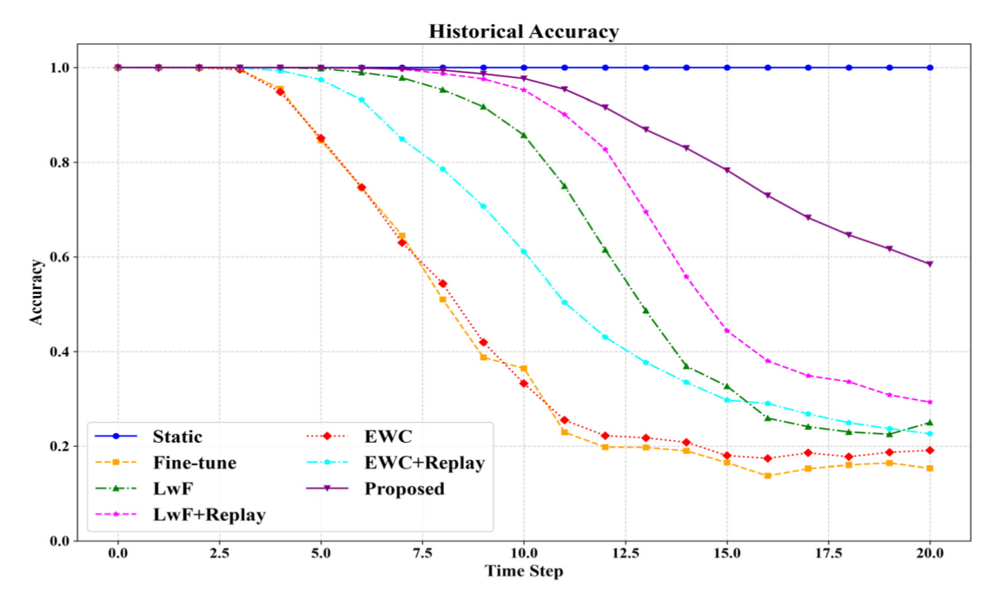
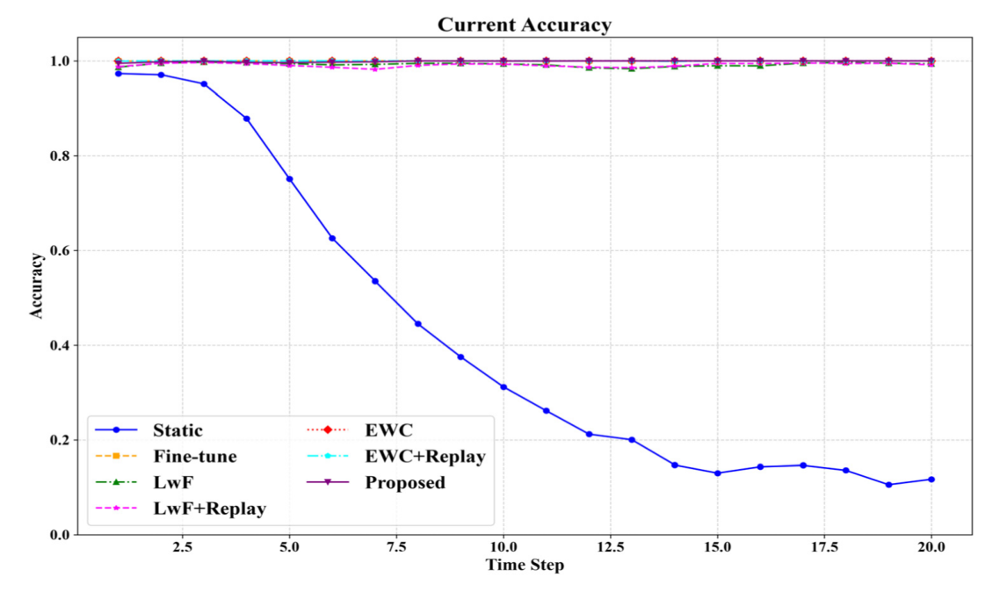
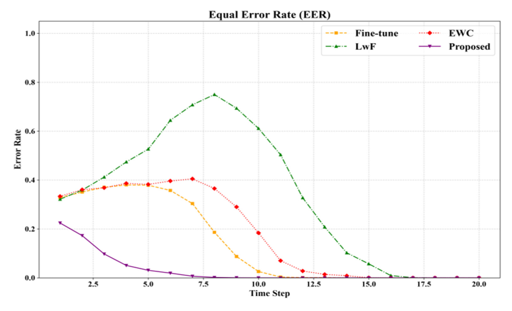
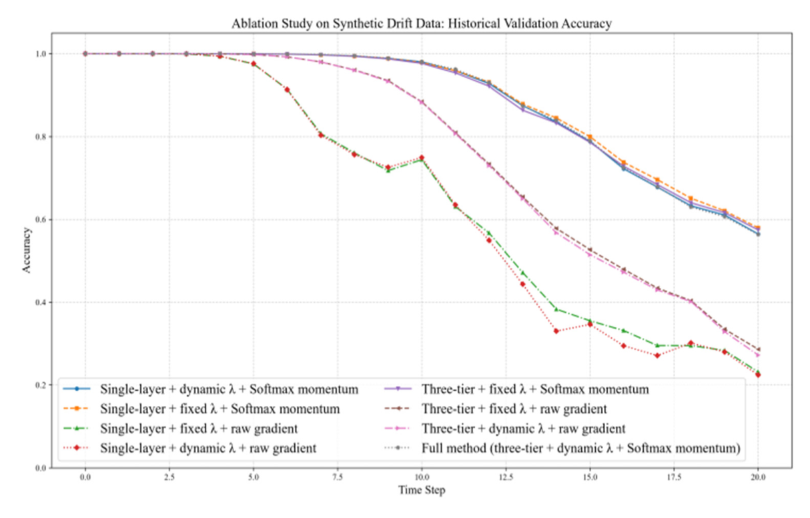
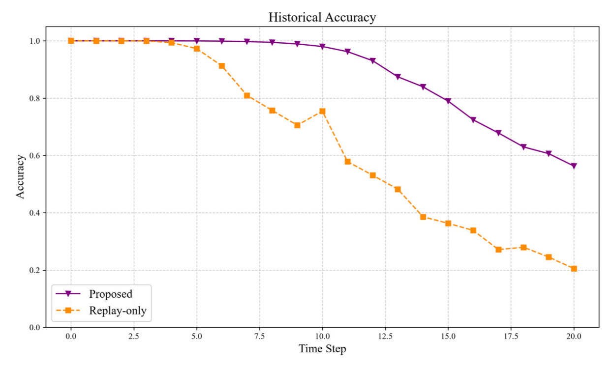
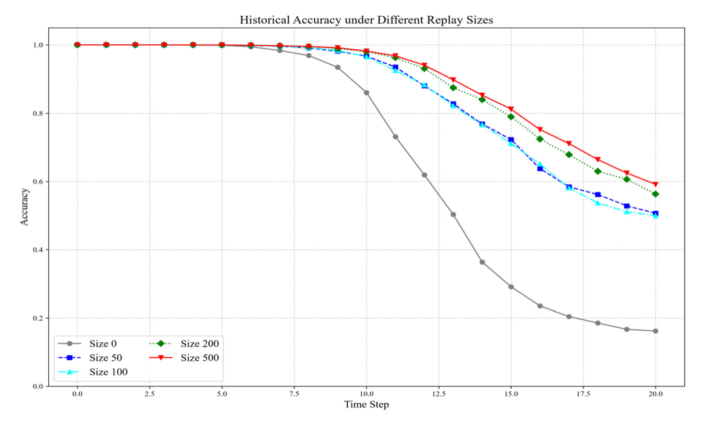
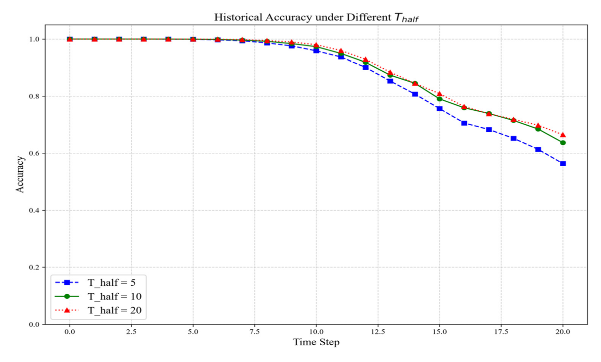

# Adaptive Feature Distillation-Based Continuous Authentication Against RF Fingerprint Drift for Power Equipment

**Fan Luo<sup>1,†</sup>, Siqin Fan<sup>1,†</sup>, Xiangjun Li<sup>2,3,\*</sup> and Weijie Xu<sup>2,3</sup>**

<sup>1</sup> College of Information Engineering, Nanchang University, Nanchang 330031, China; 5807124014@email.ncu.edu.cn (F.L.); 5807124037@email.ncu.edu.cn (S.F.)
<sup>2</sup> School of Mathematics and Computer Science, Nanchang University, Nanchang 330031, China; xuweijie@email.ncu.edu.cn
<sup>3</sup> Jiangxi Provincial Key Laboratory of Data Security Technology, Nanchang 330031, China
<sup>*</sup> Correspondence: lixiangjun@ncu.edu.cn; Tel.: +86-18679128958
<sup>†</sup> These authors contributed equally to this work.

*Article — Academic Editor: Wei Yu. Future Internet **2026**, *18*, 457. https://doi.org/10.3390/fi18090457*

| | |
|---|---|
| Received | 16 July 2026 |
| Revised | 18 August 2026 |
| Accepted | 21 August 2026 |
| Published | 27 August 2026 |
| Copyright | © 2026 by the authors. Licensee MDPI, Basel, Switzerland. |

> This article is an open access article distributed under the terms and conditions of the Creative Commons Attribution (CC BY) license.

## Abstract

RF fingerprints of power equipment drift over time due to environmental changes and device aging, which progressively degrades the performance of authentication systems built on fixed models. Existing incremental learning methods tend to either forget historical devices or fail to adapt to new distributions when dealing with such drift. We propose an incremental update strategy tailored to this scenario and evaluate it on a self-constructed 64-dimensional simulated drift dataset. At each update, gradient importance per feature channel is computed from the current batch, and three feature-level distillation terms (channel MSE, covariance alignment, and spatial attention) keep the new model's representations close to the old one. The distillation strength decays exponentially with update steps, enabling strong preservation of old knowledge early and more flexible adaptation later. A small memory buffer mixes old samples into each training batch to further reinforce historical recognition. On the synthetic dataset, our method achieves higher final historical accuracy than static, fine-tuning, EWC, and LwF baselines. Ablation studies confirm that the multi-level distillation, dynamic decay, and momentum-smoothed channel weights each contribute positively. These preliminary simulation-based results indicate that the method shows promise in alleviating forgetting caused by fingerprint drift while maintaining adaptability to new fingerprints within the synthetic evaluation framework.

**Keywords:** RF fingerprint; fingerprint drift; incremental learning; feature distillation; catastrophic forgetting

---

## 1. Introduction

In the power Internet of Things, numerous devices exchange data wirelessly, making device identity authentication a fundamental security requirement, and advanced persistent threats have become one of the most prominent cybersecurity risks [1–3]. RF fingerprinting leverages the unique signal characteristics arising from manufacturing tolerances in hardware components. Compared with conventional key- or certificate-based approaches, it is difficult to spoof and incurs no extra communication overhead, and has therefore drawn attention for access authentication of power equipment.

A practical concern, however, is that power equipment frequently operates in outdoor substations where temperature fluctuations, vibration, and component aging give rise to gradual yet persistent alterations in RF fingerprints. Prior work has shown that long-term stability of RF fingerprints is compromised by environmental factors and aging, with noticeable distribution shifts for the same device across different time periods [4].

If a statically trained model is never updated, its decision boundary gradually deviates from the actual fingerprint distribution over time. As a result, legitimate devices may fall into the rejection region, raising the false-rejection rate and disrupting normal operations. Meanwhile, the drifted feature space may overlap with signals from other devices or attackers, increasing the risk of false acceptance. Collectively, these effects cause the static authentication system to degrade progressively over extended deployment.

To sustain the authentication system over extended operation, the model must adapt to gradual fingerprint drift while retaining its ability to recognize historical fingerprints. This is essentially a continual learning problem, yet it differs from common class-incremental settings: the number of device classes remains fixed, while the intra-class fingerprint distribution shifts. Most existing incremental learning methods are designed for class-incremental scenarios [5,6]. When directly transplanted to the "fixed classes with intra-class drift" setting, the underlying assumptions upon which they rely are no longer consistent with the nature of the problem.

Concretely, among existing incremental learning techniques, plain fine-tuning promptly overwrites old knowledge when learning new fingerprints, making early-stage devices almost unrecognizable. EWC imposes a quadratic penalty on parameter changes weighted by the Fisher information matrix, but that matrix is computed from the old distribution, and its identified "important parameter directions" may no longer suit the drifted distribution. After multiple updates, the accumulated constraints form "forbidden regions" in the parameter space, severely restricting the model's flexibility—it can neither discard outdated decision boundaries nor build effective structures for the new distribution. LwF relies on the assumption that the soft outputs of the old model on new samples still contain useful information. However, when drift accumulates to a certain level, the new samples have already moved away from the old feature manifold; the soft labels become nearly uniform or over-confident for incorrect classes, and the teacher signal's signal-to-noise ratio drops sharply. Forcing the model to follow such noisy labels introduces bias—a phenomenon known in continual learning as teacher-student distribution mismatch.

To address these issues, we propose an adaptive feature distillation based continuous authentication method. The main contributions are summarized as follows:

1. We define a novel fixed-class incremental learning scenario suffering from intra-class distribution drift, which differs from conventional class-incremental learning. The proposed paradigm requires the model to stabilize inter-class decision boundaries while capturing shifting within-class data distributions.
2. We propose an adaptive multi-layer feature distillation algorithm. Unlike LWF, which only distills output logits, our method imposes three intermediate feature distillation losses for multi-scale knowledge transfer against severe fingerprint drift. Dynamic distillation decay and momentum-updated channel weights are also embedded to balance old-knowledge retention and new-distribution adaptation.
3. We adopt a tiny historical sample replay buffer to mitigate catastrophic forgetting. Simulation-based experiments on synthetic fingerprint drift datasets provide evidence that our method can outperform static training, fine-tuning, EWC and LwF in balancing historical and current prediction accuracy under controlled drift settings. Ablation tests verify the effectiveness of each core module.

The remainder of this paper is organized as follows. Section 2 reviews related work. Section 3 formulates the problem. Section 4 presents the proposed incremental update algorithm in detail. Section 5 describes the experimental setup and results. Section 6 concludes the paper and discusses future directions.

---

## 2. Related Work

### 2.1. RF Fingerprint Identification

RF fingerprinting identifies wireless devices by exploiting inherent hardware imperfections introduced during manufacturing. Components such as power amplifiers, mixers, and oscillators exhibit subtle, irreproducible features that are embedded in the transmitted signal without affecting normal communication, offering a physical-layer authentication mechanism independent of upper-layer protocols [7–9].

Early work in this area primarily relied on feature engineering. Researchers extracted hand-crafted features from time–frequency diagrams, constellation plots, and bispectra, then fed them into linear classifiers for identification [10–13]. However, under non-cooperative conditions where channel and modulation information is unavailable, the design and generalization of manual features become severely limited. In recent years, deep learning has been introduced to this field, substantially improving performance through its capacity for automatic feature extraction and nonlinear mapping. Convolutional neural networks, recurrent neural networks, and Transformer architectures have all achieved promising results in RF fingerprint identification [14–18]. These approaches learn discriminative features end-to-end from raw I/Q samples, reducing dependence on manual feature design.

That said, most existing deep learning models assume a static training set containing all devices to be recognized. In practical deployment scenarios such as the power IoT, new devices are continually added, and the signal characteristics of existing devices evolve over time. The limited adaptability of static models has thus become a growing concern.

### 2.2. Incremental Learning

Incremental learning aims to enable models to acquire new knowledge from a continuous data stream while preserving their ability to recognize previously learned information. The core difficulty lies in catastrophic forgetting: gradient updates for new tasks tend to optimize for new classes, pushing network parameters away from the original decision boundaries and thus degrading performance on old tasks.

Existing incremental learning methods can be roughly categorized by their strategy for mitigating forgetting [5]. Parameter regularization approaches, such as EWC (Elastic Weight Consolidation), use the Fisher information matrix to assess parameter importance and impose a quadratic penalty on changes to critical parameters [19]. Knowledge distillation methods, such as LwF (Learning without Forgetting), treat the old model as a teacher and distill its output predictions on new samples, encouraging the updated model to produce similar logits and thereby indirectly preserving discriminative ability for historical data [20]. Memory replay methods, such as iCaRL, maintain a fixed-size buffer of historical samples and interleave them with new data during training, directly consolidating old knowledge [21]. Dynamic architecture methods freeze existing parameters and expand the network structure at each step to accommodate new tasks.

These approaches have achieved varying degrees of success in classification tasks with growing class numbers. However, most are designed specifically for class-incremental scenarios, and few address the situation where the number of classes remains fixed while the intra-class fingerprint distribution shifts over time.

### 2.3. Incremental Learning in SEI

Research on applying incremental learning to RF fingerprint identification has grown in recent years. Zhou et al. first introduced incremental learning to this field, though their work did not thoroughly address the accumulation of forgetting over long update sequences [22]. Shi et al. adopted a combination of knowledge distillation and memory replay to mitigate forgetting, achieving promising results in variable-length signal fingerprint identification [23]. Li et al. designed a class-incremental framework without stored samples, using a student-teacher network with self-training to extend recognition to new device types [24]. Liu et al. identified fingerprint conflict as a major cause of forgetting and proposed dynamically expanding classifier parameters to distinguish devices at different learning stages [25]. Hao et al. developed a selective multi-task coordination mechanism that adaptively shares and adapts knowledge related to old tasks when learning new ones [26]. Fan et al. employed complex-valued neural networks for feature representation and devised strategies tailored to incremental learning [27]. For open-set incremental recognition, Zhang et al. proposed a contrastive learning-based method that maintains robust performance when encountering unknown devices [28]. Hua et al. combined knowledge graphs with broad learning to explore incremental SEI under few-shot conditions [29].

To clearly illustrate the differences among these efforts, Table 1 summarizes the problem settings, knowledge retention mechanisms, replay support, and evaluation metrics of each method.

**Table 1.** Comparison of incremental SEI works.

| Method | Problem Setting | Knowledge Retention Mechanism | Replay Support | Evaluation Focus |
|---|---|---|---|---|
| [22] | Class-incremental | Not specified | No | Accuracy-oriented |
| [23] | Class-incremental | Distillation + memory replay | Yes | Accuracy-oriented |
| [24] | Class-incremental | Self-training + prototype augmentation | No | Not clearly reported |
| [25] | Class-incremental | Dynamic parameter expansion | No | Not clearly reported |
| [26] | Class-incremental + distribution shift | Selective multi-task coordination | No | Signal classification |
| [27] | Class-incremental (complex-valued) | Frozen features + classifier update | No | Complex-valued signal processing |
| [28] | Class-incremental + open-set | Contrastive learning | No | Security and reliability |
| [29] | Class-incremental (few-shot) | Knowledge graph + broad learning | No | Few-shot scenarios |
| Ours | Intra-class drift (fixed classes) | Feature distillation + dynamic decay | Yes | Historical/current accuracy |

### 2.4. Distinction from Existing Incremental SEI Works

Most of the above methods—whether general-purpose techniques like EWC and LwF or those specifically tailored for SEI—are built around class-incremental settings, where the model must handle a growing number of device types. In the context of continuous authentication for power equipment, however, a more practical challenge is that the number of classes remains unchanged, while the fingerprint features of each device drift gradually due to temperature, humidity, aging, and other factors. This fingerprint drift problem is fundamentally different from class-incremental learning: the core issue is intra-class distribution shift rather than the addition of new inter-class boundaries.

There are still relatively few incremental learning methods that address the fingerprint drift scenario directly. Our work focuses on this problem and presents an update algorithm explicitly designed for it. The proposed approach does not rely on architectural expansion or new-class detection as in class-incremental methods. Instead, it operates at the feature representation level through channel-wise importance weighting, three-tier distillation losses, and dynamic strength decay, enabling the model to adapt to new fingerprint distributions while preserving discriminative power for historical ones. Compared with existing methods, our work more closely aligns with the practical requirements of long-term power equipment authentication.

---

## 3. Problem Formulation

We consider a scenario of continuous authentication for wireless devices. Suppose there are $C$ legitimate devices to be monitored over the long term, with $C$ remaining fixed. Each device embeds an RF fingerprint determined by its hardware characteristics into the transmitted signal, and this fingerprint can be extracted at the receiver as a $D$-dimensional feature vector $\boldsymbol{x} \in \mathbb{R}^{D}$. Ideally, the feature distribution of each device is relatively stable, and distinct devices exhibit separable boundaries.

In practice, however, environmental conditions and device aging cause fingerprint features to drift gradually over time. We discretize time into a sequence of update points: $t = 0, 1, 2, \ldots$, corresponding to the initial deployment and each subsequent update opportunity. Let $\mathcal{D}_t = \{(x_{t,i},\ y_{t,i})\}^{n_{t,i}}_{i=1}$ denote the labeled dataset collected at time step $t$, where $y_{t,i} \in \{1, \ldots, C\}$ indicates the device class. The class space remains the same across different time steps, yet the class-conditional feature distribution $P_t(\boldsymbol{x} \mid y)$ shifts slowly as $t$ increases.

We train a classification model $f_{\boldsymbol{\theta}}: \mathbb{R}^{D} \rightarrow \mathbb{R}^{C}$ consisting of a feature extractor $\boldsymbol{\phi}$ followed by a linear classifier $g$. Initially, we obtain $\boldsymbol{\theta}_0$ by training on $\mathcal{D}_0$. Thereafter, when a new batch $\mathcal{D}_t\ (t \geq 1)$ arrives, we no longer have access to the full historical dataset due to storage or data protection constraints. The model can only be updated using the current batch $\mathcal{D}_t$ together with a small historical cache $\mathcal{M}_{t-1}$, yielding the updated parameters $\boldsymbol{\theta}_t$.

We evaluate model performance using two metrics. The first is historical accuracy, defined as the average recognition correctness over all historical validation sets. To this end, we reserve a fixed historical validation set $\mathcal{V}_{hist}$ from the initial stage, drawn from the original distribution to represent the devices' original fingerprint profiles. The second is current accuracy, namely the recognition correctness on the current validation set $\mathcal{V}^{(t)}_{curr}$ (held out from $\mathcal{D}_t$). These are defined as:

$$
A^{(t)}_{hist} = \frac{1}{|\mathcal{V}_{hist}|}\sum_{(x,y) \in \mathcal{V}_{hist}} \mathbb{1}\left[\arg\max f_{\theta_t}(x) = y\right] \tag{1}
$$

$$
A^{(t)}_{curr} = \frac{1}{|\mathcal{V}^{(t)}_{curr}|}\sum_{(x,y) \in \mathcal{V}^{(t)}_{curr}} \mathbb{1}\left[\arg\max f_{\theta_t}(x) = y\right] \tag{2}
$$

On this basis, to further comprehensively evaluate the overall performance of the model across the entire update sequence, we introduce three derived metrics.

Average historical accuracy over all time steps $\overline{A}_{hist}$: the average of historical accuracy over all time steps, measuring the model's average ability to retain old knowledge throughout the update process:

$$
\overline{A}_{hist} = \frac{1}{T+1}\sum_{t=0}^{T} A^{(t)}_{hist} \tag{3}
$$

Average current accuracy over all time steps $\overline{A}_{curr}$: the average of current accuracy after all updates, reflecting the model's average performance in continuously adapting to new fingerprint distributions:

$$
\overline{A}_{curr} = \frac{1}{T}\sum_{t=1}^{T} A^{(t)}_{curr} \tag{4}
$$

Comprehensive stability-adaptability score $S$: at each time step, the average of historical accuracy and current accuracy is taken as the comprehensive score for that step, which is then averaged over all time steps. This score simultaneously weighs the model's stability and adaptability, with a higher score indicating better trade-off between the two:

$$
S = \frac{1}{T}\sum_{t=1}^{T}\frac{A^{(t)}_{hist} + A^{(t)}_{curr}}{2} \tag{5}
$$

Our objective is to design an update mechanism such that, after many successive updates, $A^{(t)}_{curr}$ remains at a high level—meaning the model adapts to fingerprint drift—while $A^{(t)}_{hist}$ does not drop significantly, i.e., catastrophic forgetting is avoided. The three derived metrics are then used to quantify, from a global perspective, the model's overall trade-off capability between historical retention and current adaptation.

The remainder of this paper focuses on describing the proposed incremental update algorithm, which relies only on the current batch $\mathcal{D}_t$ and a small buffer $\mathcal{M}_{t-1}$, without accessing the full historical data.

---

## 4. Methodology

In this section, we describe the proposed incremental update algorithm in detail. At each run, the algorithm takes as input the already trained old model $f_{\theta_{t-1}}$ and the current batch of new data $\mathcal{D}_t$, and outputs the updated model $f_{\theta_t}$. The key components are elaborated below.

At each incremental update, the algorithm takes the old model $f_{\theta_{t-1}}$ and current batch $\mathcal{D}_t$, and outputs the updated model $f_{\theta_t}$. The key components are elaborated below.

### 4.1. Feature Extraction and Intermediate Layer Outputs

The fingerprint samples used in this work are 64-dimensional feature vectors generated by a simulated drift model. To accommodate the CNN architecture, each 1D vector is reshaped into a 2D matrix. Inspired by prior work that reorganizes 1D sequences into 2D matrices for CNN-based feature extraction, we reshape the 64-dimensional vector into an $8 \times 8$ feature map in row-major order, i.e., $x \in \mathbb{R}^{1 \times 8 \times 8}$.

It is worth noting that, although the arrangement of the 64 feature dimensions involves some design freedom, the translation invariance and local connectivity of convolution do not require the input dimensions to have a natural physical adjacency—the essence is to nonlinearly combine and abstract joint patterns across feature dimensions. In our task, all 64 dimensions jointly characterize the RF fingerprint of the same device, and they are inherently correlated through their common response to hardware states. The 2D reshaping followed by CNN extraction allows us to uncover these joint patterns more parameter-efficiently than a fully-connected network. Moreover, the spatial attention alignment used in the two-level distillation operates on the feature maps learned by the CNN rather than on the physical space of the raw input. Thus, even if the original dimension arrangement involves some arbitrariness, the spatial positions on the feature maps reflect the model's learned abstractions rather than a direct dependency on the physical locations of input dimensions.

The model $f_{\theta}$ consists of a feature extractor $\phi$ and a linear classifier $g$. The feature extractor is composed of two convolutional blocks stacked sequentially:

- The first convolution uses a $3 \times 3$ kernel with stride 1 and padding 1, mapping the input $8 \times 8$ feature map to 16 channels while keeping the spatial size unchanged. Its output shape is $B \times 16 \times 8 \times 8$, denoted as $Z_1$.
- The second convolution uses a $3 \times 3$ kernel with stride 2 and padding 1, increasing the channel count to 32 while halving the feature map size to $4 \times 4$ via down-sampling. Its output shape is $B \times 32 \times 4 \times 4$, denoted as $Z_2$. This down-sampling enlarges the receptive field, enabling higher-level features to integrate information from larger local regions.

After these two blocks, global average pooling compresses $Z_2$ into a $B \times 32$ feature vector, which is then fed into a fully-connected layer to produce $B \times 10$ classification logits for identifying the 10 device classes.

To facilitate multi-layer distillation, we extract the feature maps $Z_1$ and $Z_2$ from the outputs of the two convolutional blocks, respectively. $Z_1$ preserves higher spatial resolution and contains fine-grained local features; $Z_2$ has lower spatial resolution but more channels and a larger receptive field, encoding higher-level abstract features. These two layers characterize the discriminative structure of the input fingerprint at different granularities, and their joint distillation helps the new model mimic the old model's feature representations across multiple scales.

### 4.2. Channel Importance Weights

During incremental updates, we wish to preserve those feature channels that are most critical for the old classification task. A natural criterion for assessing channel importance is the extent to which a perturbation to that channel affects the classification loss: if a slight change in a channel's feature leads to a large loss increase, that channel should be given higher protection.

Based on this idea, we compute the expected squared gradient for each channel using the old model $f_{\theta_{t-1}}$ on the current batch $\mathcal{D}_t$. Specifically, for the $c$-th channel of layer $l$, we define:

$$
S_{l,c} = \mathbb{E}_{(x,y) \sim \mathcal{D}_t}\left[ \left\| \nabla_{Z_{l,c}}\, \mathcal{L}_{cls}\left(f_{\theta_{t-1}}(x), y\right) \right\|^{2}_{F} \right] \tag{6}
$$

where $\mathcal{L}_{cls}$ is the cross-entropy loss, $\|\cdot\|_{F}$ denotes the Frobenius norm, and $Z_{l,c}$ is the feature map of the $c$-th channel in that layer. This expectation reflects the sensitivity of the classification loss to perturbations of that channel.

Once $S_{l,c}$ is obtained, we apply a temperature-scaled Softmax normalization, and then propagate the weights from the previous time step using momentum:

$$
\widetilde{W}^{(t)}_{l,c} = \frac{\exp(S_{l,c}/\tau)}{\sum_{j} \exp(S_{l,j}/\tau)}, \quad
W^{(t)}_{l,c} = \alpha_m W^{(t-1)}_{l,c} + (1 - \alpha_m)\,\widetilde{W}^{(t)}_{l,c} \tag{7}
$$

Here, $\tau$ controls the sharpness of the Softmax, and $\alpha_m$ is the momentum coefficient. This design ensures that the importance weights evolve smoothly across time steps, mitigating abrupt fluctuations caused by noise in a single batch. $W^{(t)}_{l,c}$ is then used as the weight for that channel in the subsequent distillation losses.

### 4.3. Multi-Layer Feature Distillation Losses

The distillation loss constrains the feature representations of the new mode $f_{\theta_t}$ from deviating too far from those of the old model $f_{\theta_{t-1}}$. We design three alignment objectives, corresponding to channel-wise numerical similarity, inter-channel correlation structure, and spatial response distribution.

**Channel-wise alignment.** For each selected layer (here we take the output layers of the two convolutional blocks), we compute the MSE between corresponding channels of the new and old feature maps, weighted by the importance weights obtained earlier:

$$
\mathcal{L}_{channel} = \sum_{l \in \{1,2\}} \sum_{c=1}^{C_l} W^{(t)}_{l,c} \cdot \mathbb{E}_{x \sim \mathcal{D}_t}\left[ \left\| Z^{\mathrm{new}}_{l,c}(x) - Z^{\mathrm{old}}_{l,c}(x) \right\|^{2}_{2} \right] \tag{8}
$$

**Covariance alignment.** Channel-wise alignment only considers each channel in isolation and ignores inter-channel dependencies. We additionally encourage the covariance matrices of the new and old feature maps to be as consistent as possible. The feature maps are flattened into an $N \times (C_l \cdot H_l \cdot W_l)$ matrix, their covariance matrices are computed, and the MSE between them is taken:

$$
\mathcal{L}_{cov} = \sum_{l \in \{1,2\}} \left\| \mathrm{Cov}\left(Z^{\mathrm{new}}_{l}\right) - \mathrm{Cov}\left(Z^{\mathrm{old}}_{l}\right) \right\|^{2}_{F} \tag{9}
$$

**Spatial attention alignment.** Different spatial regions contribute differently to classification. We encourage the new model to learn a spatial attention distribution similar to that of the old model. We first compute the energy at each spatial position (i.e., the sum of squared values across channels), then apply per-sample max normalization to obtain a spatial attention map $A \in \mathbb{R}^{H \times W}$. The MSE between the new and old attention maps is then computed:

$$
\mathcal{L}_{spatial} = \sum_{l \in \{1,2\}} \mathbb{E}_{x \sim \mathcal{D}_t}\left[ \left\| A^{\mathrm{new}}_{l}(x) - A^{\mathrm{old}}_{l}(x) \right\|^{2}_{2} \right] \tag{10}
$$

The overall distillation loss is their weighted sum:

$$
\mathcal{L}_{distill} = \mathcal{L}_{channel} + \lambda_{cov}\, \mathcal{L}_{cov} + \lambda_{spatial}\, \mathcal{L}_{spatial}
$$

### 4.4. Dynamic Distillation Strength

If the distillation weight remains consistently large, the model becomes overly biased toward preserving old knowledge and struggles to learn new fingerprints; if it is too small, forgetting intensifies. We adopt an exponential decay strategy with the number of updates. Suppose $t$ incremental updates have been completed; the distillation strength used at the $t$-th update is

$$
\lambda^{(t)}_{distill} = \lambda_{init} \cdot \exp\left(-\frac{t}{T_{\mathrm{half}}}\right) + \lambda_{\mathrm{min}} \tag{11}
$$

In this way, the model receives strong protection in the early stages, securely retaining old knowledge; in later stages, it gains more flexibility to adapt to fingerprint drift and improve current accuracy.

### 4.5. Historical Sample Replay

Although the distillation loss already provides some resistance to forgetting, directly exposing the model to old samples remains the most straightforward and effective consolidation mechanism. We maintain a fixed-size buffer $\mathcal{M}$ that stores a subset of recently encountered training samples. The buffer is initialized as empty at the first time step; when it is empty, the replay mechanism is simply skipped and the model is updated using only the current batch. When a new batch arrives, we randomly sample a batch from the buffer and concatenate it with the current batch to form a larger training batch. At each incremental update, the model is trained for multiple epochs. In each epoch, we draw a random mini-batch from the replay buffer (with a batch size of 32) independently, meaning that the sampled combination varies across epochs. This combined batch contains both new and old samples, and the model is updated using the cross-entropy classification loss computed on this combined batch. This effectively allows the model to review old knowledge while learning new information. The buffer capacity is set to 200 samples, with a FIFO replacement policy that discards the oldest samples when the capacity is exceeded.

### 4.6. Overall Loss and Update Procedure

The overall loss function at each incremental update is

$$
\mathcal{L}_{\mathrm{total}} = \mathcal{L}_{\mathrm{cls}} + \lambda^{(t)}_{\mathrm{distill}}\, \mathcal{L}_{\mathrm{distill}} \tag{12}
$$

where $\mathcal{L}_{\mathrm{cls}}$ is the standard cross-entropy loss computed on the combined batch of new samples and replayed samples. We use the Adam optimizer with a fixed learning rate of 0.001 and train for 5 epochs at each time step. The parameters of the old model are completely frozen throughout the update process, serving only for computing the distillation loss and providing importance weights.

Algorithm 1 presents the pseudocode of the above procedure.

**Algorithm 1.** Single Incremental Update

```
Input:  Old model f(θ_t−1), current dataset D_t, buffer M,
        hyperparameters λ_init, λ_min, T_half, λ_cov, λ_spatial, α_m, τ
Output: New model f(θ_t), updated buffer M′

 1:   Compute channel importance weights W^(t)_{l,c} for each layer using D_t and f(θ_t−1)
 2:   Compute current distillation strength λ^(t)_distill = λ_init·exp(−t/T_half) + λ_min
 3:   If the buffer is empty, skip replay and use only D_t. Otherwise, sample a batch from
      buffer M with batch size 32 (independent random draw for each epoch) and concatenate
      with D_t to form combined batch B
 4:   for epoch = 1 to distillation epochs do
 5:       for each (x, y) in B do
 6:           z_new, F_new = f(θ_t)(x)
 7:           with torch.no_grad(): z_old, F_old = f(θ_t−1)(x)
 8:           L_cls = CrossEntropy(z_new, y)
 9:           L_distill = L_channel + λ_cov·L_cov + λ_spatial·L_spatial
10:           L_total = L_cls + λ_distill^(t)·L_distill
11:       Backpropagate and update f(θ_t)
12:       end for
13:   end for
14:   Add samples from D_t to buffer M′; if capacity exceeded, remove the oldest
15:   return f(θ_t), M′
```

---

## 5. Experiments and Analysis

We conduct a series of experiments to evaluate the effectiveness of the proposed method. We first describe the data generation procedure, baseline methods, evaluation metrics, and hyperparameters, then present comparison results against existing approaches, and finally analyze the contribution of each component through ablation studies.

### 5.1. Data Generation and Experimental Setup

We generate fingerprint drift data through simulation. For ease of reference, Tables 2–4 list the data generation parameters, the parameters of the physically inspired drift model, and the hyperparameters for model training and baseline methods, respectively.

**Table 2.** Basic data generation parameters.

| Parameter | Value | Description |
|---|---|---|
| Number of device classes | 10 | Number of legitimate devices |
| Feature dimension | 64 | Dimension per fingerprint sample |
| Initial samples per class | 2000 | Used for training the initial model |
| Historical validation samples per class | 200 | Fixed, drawn from initial distribution |
| Total time steps | 20 | Number of incremental updates |
| New samples per class per time step | 200 | Generated after drift |
| Train/validation split ratio | 8:2 | 80% training, 20% validation from new samples |
| Base noise standard deviation | 0.1 | Gaussian noise for sample generation |

**Table 3.** Parameters of the physically inspired drift model.

| Parameter | Symbol | Value | Description |
|---|---|---|---|
| Warm-up amplitude | $\alpha$ | 0.3 | Maximum drift during warm-up phase |
| Warm-up decay constant | $\tau_w$ | 5 steps | Exponential decay rate |
| Periodic amplitude | $A$ | 0.1 | Sinusoidal fluctuation magnitude |
| Period length | $T_c$ | 10 steps | Duration of one complete cycle |
| Aging slope | $\beta$ | 0.02 | Linear increment per step |
| Feature sensitivity range | $u_i$ | [0.5, 2.0] | Generated per dimension based on characteristics |
| Device individual variation std | $\sigma_{dev}$ | 0.1 | Initial std of fixed bias |

**Table 4.** Hyperparameters for model training and baselines.

| Parameter | Value | Description |
|---|---|---|
| Initial training epochs | 40 | Epochs for training the initial model |
| Incremental update epochs | 5 | Distillation epochs per time step |
| Learning rate | 0.001 | Adam optimizer |
| Replay buffer capacity | 200 | Number of samples |
| Initial distillation strength $\lambda_{init}$ | 1.0 | Starting point of dynamic decay |
| Minimum distillation strength $\lambda_{min}$ | 0.2 | Lower bound of decay |
| Half-life $T_{half}$ | 10 steps | Exponential decay rate |
| Covariance loss weight $\lambda_{cov}$ | 0.1 | |
| Spatial attention loss weight $\lambda_{spatial}$ | 0.1 | |
| Importance weight temperature $\tau$ | 2.0 | |
| Importance weight momentum $\alpha_m$ | 0.95 | |
| EWC Fisher sample size | 200 | |
| EWC regularization coefficient | 10.0 | |
| LwF distillation temperature | 2.0 | |
| LwF distillation weight | 1.0 | |

For EWC, the regularization coefficient was determined through a preliminary grid search over {1, 5, 10, 20, 50} on the validation set. The final historical accuracy at step 20 for each candidate was 0.114, 0.124, 0.140, 0.175, and 0.209, respectively. The gain in performance saturates beyond a coefficient of 10, with marginal improvements thereafter. We therefore select a coefficient of 10, as it achieves stable performance within the range suggested in the original EWC work [19], while avoiding excessive regularization that may hinder adaptation to new data. For LwF, we adopt the standard configurations from the original paper, i.e., a distillation temperature of 2 and a distillation weight of 1 [20].

#### Physical Basis and Implementation Details of Data Generation

Early simulations often used Gaussian random walks to model fingerprint changes, but actual device fingerprint drift is not purely random. Prior studies and measured data indicate that RF fingerprint variations are primarily driven by three factors: (i) **warm-up effects**—as devices transition from cold start to thermal equilibrium, components such as oscillators and power amplifiers warm up, causing rapid yet gradually decelerating changes in carrier frequency offset and related features; (ii) **periodic environmental temperature fluctuations**—diurnal and seasonal variations induce periodic frequency shifts in oscillators; and (iii) **irreversible hardware aging**—long-term operation leads to monotonic, slow drift due to power amplifier nonlinearity degradation and crystal aging. Moreover, different RF parameters exhibit varying sensitivity to these factors, and even devices from the same production batch diverge in their drift trajectories due to manufacturing tolerances.

Based on these considerations, we design a hybrid drift model that incorporates warm-up, periodic, and aging terms, along with feature-dimension sensitivity and device-specific biases. The implementation is as follows.

**Global direction vector:** A random unit vector $d \in \mathbb{R}^{64}$ is first generated and kept fixed throughout the drift process, shared across all devices. It represents the overall principal direction of fingerprint drift.

**Drift scalar at step $t$:**

$$
s(t) = \alpha\left(1 - e^{-t/\tau_w}\right) + A\sin\left(\frac{2\pi t}{T_c}\right) + \beta t \tag{13}
$$

The first term models rapid warming after power-on followed by saturation; the second term captures periodic environmental temperature fluctuations; the third term accounts for irreversible hardware degradation.

**Feature-dimension sensitivity:** A sensitivity coefficient $u_i$ is generated for each feature dimension $i$, indicating how responsive that dimension is to drift. The global drift vector is then:

$$
\Delta_{\mathrm{global}}(t) = s(t) \cdot \left(u_i \cdot d_i\right)^{64}_{i=1} \tag{14}
$$

**Device-specific bias:** Each device $c$ has a fixed bias vector $b_c \sim \mathcal{N}\left(0, \sigma^{2}_{dev} I\right)$, which is slowly amplified over time to reflect the gradual emergence of individual differences with runtime:

$$
b^{(t)}_c = b_c \cdot \left(1 + 0.02 t\right) \tag{15}
$$

The cumulative drift for device $c$ at step $t$ is thus:

$$
\Delta_c(t) = \Delta_{\mathrm{global}}(t) + b^{(t)}_c \tag{16}
$$

**Prototype update:** At the initial time step, each device $c$ has a prototype $p^{(0)}_c$ initialized as a random unit vector. The prototype at step $t$ is:

$$
p^{(t)}_c = p^{(0)}_c + \Delta_c(t) \tag{17}
$$

The parameter values used in this simulation reference existing experimental observations in RF fingerprinting and industrial specifications for crystal oscillators. The warm-up time constant $\tau_w = 5$ steps is set with reference to observations that signal characteristics tend to stabilize roughly 12 min after power-on in hardware warm-up experiments. The periodic amplitude $A = 0.1$ references the ±20 ppm frequency stability range of typical crystal oscillators over the full temperature range. The aging slope $\beta = 0.02$ references the ±2 to ±5 ppm first-year aging rate specifications for crystal oscillators. Since this work focuses on validating incremental learning algorithms under fingerprint drift, the simulation parameters maintain consistency with physical priors in terms of magnitude rather than precisely fitting measured drift curves of any specific device model.

**Sample generation procedure:** At each time step, the prototypes of all devices are first updated according to the above model. New samples are then generated from the current prototypes: for device $c$, each sample $= \text{prototype } p^{(t)}_c + \text{Gaussian noise } \mathcal{N}\left(0, 0.1^{2} I\right)$. The generated samples are split into training and validation sets at an 8:2 ratio. All 64-dimensional samples are reshaped into $8 \times 8$ feature maps as network input.

It is important to note that the following experimental results are obtained on a self-constructed synthetic dataset. The physical drift model incorporated in the data generation process—including warm-up, periodic fluctuations, and aging terms—is designed to emulate the characteristics reported in prior empirical studies of RF hardware. However, synthetic data cannot fully capture the complexity of real-world field signals, which may be affected by unmodeled factors such as multipath propagation, interference, and device-specific manufacturing variances. Therefore, the results presented in this section should be interpreted as preliminary proof-of-concept evidence within the simulation framework, rather than conclusive evidence of real-world system performance.

### 5.2. Baseline Methods

We select the following methods for comparison:

- **Static model:** The model is not updated after initial training and is tested directly on the validation sets at all time steps.
- **Fine-tuning:** At each time step, the model is trained solely on the current batch of new samples for 5 epochs without any anti-forgetting constraint.
- **EWC:** During training on new samples at each time step, a quadratic penalty weighted by the Fisher information matrix is added to the loss.
- **EWC+Replay:** At each time step, the EWC penalty is applied on the joint batch of new samples and replayed samples, using the same replay buffer configuration as our method.
- **LwF:** At each time step, the model is trained on new samples while distilling the output probabilities of the old model, without storing historical samples.
- **LwF+Replay:** At each time step, the LwF distillation loss is computed on the joint batch of new samples and replayed samples, with the replay buffer configuration identical to our method.
- **Ours:** The full algorithm described in Section 4, including channel importance weights, three-tier distillation losses, dynamic distillation strength decay, and a replay buffer of capacity 200.

### 5.3. Evaluation Metrics

We focus on the following metrics:

- **Historical accuracy:** The average recognition correctness on a fixed historical validation set, consisting of 2000 samples held out from the initial stage and covering all 10 device classes. This metric reflects the model's ability to retain the old fingerprint distribution.
- **Current accuracy:** The recognition correctness on the validation set at each time step. This metric reflects the model's ability to adapt to the new fingerprint distribution.
- **Average historical accuracy over all time steps:** The average of historical accuracy over all time steps, measuring the model's average retention of old knowledge throughout the entire update sequence.
- **Average current accuracy over all time steps:** The average of current accuracy after all updates, reflecting the model's average performance in continuously adapting to new fingerprint distributions.
- **Comprehensive stability-adaptability score:** At each time step, the average of historical accuracy and current accuracy is taken as the comprehensive score for that step, which is then averaged over all time steps. This score simultaneously weighs the model's stability and adaptability; a higher score indicates a better trade-off between the two.

In addition, we compute the forgetting rate at the final time step, defined as the relative decline in historical accuracy from the initial stage to the end.

### 5.4. Comparison with Existing Methods

Figure 1 shows the historical accuracy of each method over all time steps. The static model, never updated after initial training, maintains 100% historical accuracy throughout because the historical validation set shares the same distribution as the initial training data. This does not imply that the static model is optimal overall, however—as seen in Figure 2, its current accuracy drops to 11.7% due to increasing drift, indicating that it fails entirely to adapt to new fingerprint distributions and is impractical for real authentication scenarios.



**Figure 1.** Historical accuracy over time steps.

Fine-tuning and EWC preserve high current accuracy, but their historical accuracy declines most severely, falling below 20% after 20 updates—a clear sign of catastrophic forgetting. LwF exhibits moderate resistance to forgetting, with a relatively gentle decline in the first 10 steps, yet after step 10 its historical accuracy also drops rapidly to below 25% by the final step. When augmented with replay, LwF+Replay and EWC+Replay show modest improvements over their standard counterparts, achieving final historical accuracies of approximately 29.3% and 22.6%, respectively—about 5 and 3 percentage points higher than LwF and EWC without replay. This confirms that replay alone provides a degree of forgetting resistance, consistent with findings in the continual learning literature. Nevertheless, both LwF+Replay and EWC+Replay still fall considerably short of our method, which consistently outperforms all competitors on historical accuracy across the entire 20-step sequence, with a relatively slow decay and a final value of approximately 58.4%—about 36 percentage points higher than EWC+Replay and 29 points higher than LwF+Replay.



**Figure 2.** Current accuracy over time steps.

Figure 2 presents the current accuracy curves. The static model shows a steady decline as drift accumulates, ending at only 11.7%. All other methods, however, maintain current accuracy at nearly 100% after each update, suggesting that under this simulated drift pattern, all update-based models correctly learn the characteristics of the new samples. The inclusion of replay does not significantly affect current accuracy, as both LwF+Replay and EWC+Replay achieve performance comparable to their non-replay counterparts and to our method.

Taken together, these results indicate that our method protects old knowledge without excessively sacrificing adaptability to new fingerprints, demonstrating practical potential for deployment.

To provide a more comprehensive comparison of the overall performance of each method, we further introduce three metrics—average historical accuracy over all time steps, average current accuracy over all time steps, and the comprehensive stability-adaptability score—to quantitatively evaluate the global behavior of each method across the entire update sequence. The comparison results of all methods on these three metrics are presented in Table 5.

**Table 5.** Multi-metric comparison of different methods on the simulated drift data.

| Method | Average Historical Accuracy | Average Current Accuracy | Stability–Adaptability Score S |
|---|---|---|---|
| Static | 1.0000 | 0.4210 | 0.7105 |
| Fine-tune | 0.4856 | 1.0000 | 0.7299 |
| LwF | 0.6879 | 0.9923 | 0.8323 |
| LwF+Replay | 0.7621 | 0.9913 | 0.8707 |
| EWC | 0.4983 | 1.0000 | 0.7366 |
| EWC+Replay | 0.6221 | 0.9999 | 0.8016 |
| **Proposed** | **0.8841** | 0.9990 | **0.9386** |

In terms of average historical accuracy over all time steps, the proposed method achieves 0.8841, substantially higher than Fine-tune, EWC, and LwF. Notably, LwF+Replay and EWC+Replay achieve 0.7621 and 0.6221, respectively, outperforming their standard versions by 7.4 and 12.4 percentage points, which further confirms the benefit of replay for preserving historical knowledge. However, the proposed method still surpasses LwF+Replay by 12.2 percentage points and EWC+Replay by 26.2 percentage points, indicating that the feature distillation module provides complementary benefits beyond what replay alone can offer.

Regarding average current accuracy over all time steps, the proposed method attains 0.9990, which is on par with Fine-tune, EWC, and LwF—all close to 1.0—demonstrating that all updating methods can effectively adapt to new fingerprint distributions. The addition of replay slightly reduces current accuracy for LwF+Replay (0.9913 vs. 0.9923 for LwF), but the difference is marginal, suggesting that replay does not substantially compromise adaptability to new data. The comprehensive stability-adaptability score $S$ integrates both historical retention and current adaptation. Our method ranks first with 0.9386, outperforming LwF+Replay (0.8707) by approximately 6.8 percentage points and EWC+Replay (0.8016) by about 13.7 percentage points. Both LwF+Replay and EWC+Replay show improved $S$ scores over their standard counterparts, confirming that replay enhances the overall trade-off between stability and adaptability. The proposed method still maintains a clear advantage, validating the effectiveness of the combined distillation-and-replay strategy.

To further evaluate authentication security beyond classification accuracy, we introduce the Equal Error Rate (EER) as a complementary metric. EER is the error rate at which the False Acceptance Rate (FAR) equals the False Rejection Rate (FRR), where a lower value indicates higher security. For EER evaluation, we consider both legitimate devices (10 known classes) and unauthorized devices. The unauthorized devices are generated independently as an open set, with class labels set to −1, and are not drawn from the 10 known classes. This simulates realistic scenarios where attackers or unregistered devices are previously unseen. At each evaluation step, we extract a 32-dimensional feature vector for each sample via global average pooling of the second convolutional layer output. Class centers are computed as the mean feature vector of each legitimate class from the initial training set. For a given sample, we compute its Euclidean distance to the nearest class center—this distance serves as the authentication score, where smaller values indicate higher likelihood of legitimacy. Genuine pairs are formed from legitimate validation samples, while impostor pairs are formed from the independently generated open-set samples. We then enumerate 1001 candidate thresholds over the range of all distances. For each threshold, FAR is computed as the proportion of impostor samples whose distance falls below the threshold (i.e., falsely accepted as legitimate), and FRR is computed as the proportion of genuine samples whose distance exceeds the threshold (i.e., falsely rejected). EER is approximated by finding the threshold that minimizes the absolute difference between FAR and FRR and taking the average of the two rates at that threshold.

This EER evaluation is complementary to classification accuracy: accuracy reflects the model's ability to correctly classify legitimate devices into their respective classes, while EER reflects the model's ability to reject completely unknown devices. Reporting both metrics provides a more comprehensive assessment of the authentication system's practical security. Figure 3 presents the EER curves of different methods over time steps.



**Figure 3.** EER curves of different methods over time steps.

As shown in Figure 3, the EER of all methods exhibits an upward trend in the first five steps as fingerprint drift accumulates. Among them, LwF shows the fastest increase, indicating that this method is more severely affected by fingerprint drift in terms of authentication security. The EER of Fine-tune and EWC, while rising more gradually, still reveals a continuous decline in authentication security even though their current accuracy remains high—the model can still assign samples to the correct device classes, yet the uncertainty around the decision boundary grows, leading to an increasing risk of false acceptance of illegitimate devices. In contrast, the proposed method maintains the lowest EER across all time steps, exhibiting a declining trend with fast convergence. This demonstrates that, under the combined effect of feature distillation and replay mechanisms, our method not only preserves high classification accuracy but also effectively maintains the reliability of the decision boundary, significantly reducing the risk of false acceptance of unauthorized devices.

### 5.5. Ablation Studies and Parameter Sensitivity

To isolate the contribution of each design component, we progressively remove certain elements from the full method to construct variants and compare their historical accuracy. The ablation configurations are as follows:

- **A.** (Single layer + fixed λ + raw gradient): Only channel-wise MSE distillation is retained, with a fixed strength of 1.0. No Softmax or momentum is used; importance weights are directly taken as the raw gradient expectations.
- **B.** (Single layer + dynamic λ + raw gradient): Adds dynamic distillation strength to A.
- **C.** (Single layer + fixed λ + Softmax momentum): Replaces the importance weights with Softmax momentum based on A, while keeping distillation strength fixed.
- **D.** (Single layer + dynamic λ + Softmax momentum): Adds dynamic distillation strength to C.
- **E.** (Three layer + fixed λ + raw gradient): Restores covariance and spatial attention alignment, but keeps distillation strength fixed and importance weights as raw gradients.
- **F.** (Three layer + dynamic λ + raw gradient): Adds dynamic distillation strength to E.
- **G.** (Three layer + fixed λ + Softmax momentum): Adds Softmax momentum to E, while keeping distillation strength fixed.
- **Full method:** Three-layer + dynamic λ + Softmax momentum.

All ablation variants use the same replay buffer of capacity 200. Figure 4 presents the historical accuracy curves of all variants.



**Figure 4.** Historical accuracy of ablation variants over time steps.

Several trends can be observed from Figure 4. First, dynamic distillation strength generally yields historical accuracy about 1–2 percentage points lower than its fixed-strength counterpart (comparing A vs. B, C vs. D), and this gap widens over time. This is because a fixed strong distillation constraint preserves historical knowledge maximally but continuously restricts the parameter space available for adapting to new distributions, making it harder to fit drifted fingerprints. In contrast, dynamic strength offers strong protection early and gradually releases constraints as $t$ increases, providing greater flexibility for adaptation.

Second, in the absence of Softmax momentum (i.e., using raw gradient weights), switching from single-layer to three-tier distillation (A→E, B→F) brings a substantial improvement in historical accuracy—about 20 percentage points at step 20. This confirms that covariance and spatial attention alignments indeed better preserve the discriminative structure of old fingerprints.

Third, after Softmax momentum is introduced, the gain from three-tier distillation becomes considerably smaller (the gap between C and G is much narrower than between A and E). In fact, at some time steps, C (single-layer + fixed λ + Softmax momentum) and G (three-layer + fixed λ + Softmax momentum) exhibit nearly identical historical accuracy. This suggests that when importance weights are smoothed by momentum, the model already possesses strong anti-forgetting capability, and the additional covariance and spatial attention constraints become less critical. A plausible explanation is that momentum carries historical information through the importance weights across steps, indirectly limiting the overall drift magnitude of the feature space, thus reducing the marginal benefit of higher-order structural constraints.

Finally, the full method (three-layer + dynamic λ + Softmax momentum) achieves the best historical accuracy among all variants, though the advantage over D (three-layer + dynamic λ + Softmax momentum) or G (three-layer + fixed λ + Softmax momentum) is not dramatic. This indicates some redundancy between dynamic distillation strength and Softmax momentum, yet their combination still yields optimal performance.

We further evaluate a Replay-only baseline that disables all distillation losses while keeping the replay buffer unchanged. As shown in Figure 5, the full Proposed method consistently outperforms Replay-only across all time steps, with a final historical accuracy gap of approximately 38 percentage points at step 20. This gap quantifies the independent contribution of the feature distillation module, confirming that the multi-level alignment constraints provide substantial anti-forgetting benefits beyond the replay mechanism alone.



**Figure 5.** Historical accuracy comparison between the full Proposed method and the Replay-only baseline.

To further assess the robustness of the proposed method to hyperparameter choices, we examine two key parameters: the replay buffer capacity and the distillation decay half-life. Figure 6 shows the historical accuracy under different buffer sizes ranging from 0 to 500. The performance improves as the capacity increases from 0 to 200, but saturates beyond 200, indicating that a moderate buffer size is sufficient and the method does not require large memory overhead. Figure 7 presents the results under different decay half-lives. The method achieves final historical accuracies of 0.5635, 0.6371, and 0.6647 for $T_{\mathrm{half}} = 5$, 10, and 20, respectively. The performance improves as $T_{\mathrm{half}}$ increases from 5 to 10, but the gain from 10 to 20 is marginal, suggesting that the method performs consistently across moderate to longer half-lives and is not highly sensitive to the precise choice of this parameter, as long as it is set within a reasonable range.



**Figure 6.** Historical accuracy under different replay buffer capacities (M = 0, 50, 100, 200, 500).



**Figure 7.** Historical accuracy under different distillation decay half-lives (Thalf = 5, 10, 20).

### 5.6. Discussion

The above results lead to several observations. First, covariance and spatial attention alignments are highly effective when momentum is not used, offering an alternative for scenarios where momentum is inconvenient to apply. Second, once momentum-smoothed channel importance weights are adopted, the need for higher-order distillation losses may be decided based on computational budget—retaining them pursues peak performance, while dropping to single-layer distillation reduces training time.

Moreover, from Figures 1 and 4, we observe that our method and several ablation variants outperform EWC and LwF on historical accuracy. This suggests, within our experimental framework, that imposing structured constraints at the feature level is more effective at mitigating forgetting under intra-class drift than constraining parameters or output probabilities alone. A possible reason is that feature layers directly carry discriminative information essential for classification, whereas parameter constraints affect features only indirectly, and output-level distillation may discard structured information encoded in intermediate layers. That said, our method also incorporates replay beyond distillation, so the above conclusion should be understood within the overall design of our framework; the relative contributions of different distillation levels require further refined ablations.

The sensitivity analysis in Section 5.5 confirms that the proposed method maintains stable performance across a range of buffer capacities and decay half-lives, further supporting its robustness.

### 5.7. Summary of Experiments

In this section, we have provided preliminary evidence for the effectiveness of the proposed incremental update algorithm on a 64-dimensional simulated drift dataset under the designed simulation conditions. Compared with the static model, fine-tuning, EWC, and LwF, our method achieves superior historical accuracy while maintaining high current accuracy. Ablation studies further reveal the respective roles of dynamic distillation strength, multi-tier distillation losses, and Softmax+momentum: dynamic strength trades a minor reduction in historical accuracy for better adaptability to new fingerprint distributions; three-tier distillation provides significant gains without momentum but offers only marginal improvements when momentum is present, indicating that momentum-smoothed channel importance weights already confer strong forgetting resistance. These results, while limited to our simulation framework, suggest the effectiveness of the proposed method as a promising direction for further investigation. Future work will extend the evaluation to public long-term fingerprint datasets for broader validation. Sensitivity analysis on key hyperparameters further confirms that the method performs stably across a range of configurations.

---

## 6. Conclusions

This paper proposes an incremental update algorithm for slow RF fingerprint drift in long-term power equipment operation. It balances knowledge retention and new distribution adaptation via gradient-based channel importance weights, three feature-level distillation constraints (channel-wise MSE, covariance alignment, and spatial attention alignment), gradually decaying distillation strength, and a small historical replay buffer. In simulation experiments spanning 20 drift stages, our method achieves 58.4% historical accuracy at step 20—outperforming LwF by 34 percentage points—while maintaining decent current accuracy. Ablation studies provide support for the contributions of dynamic distillation, multi-layer distillation losses, and momentum-based channel weight updates.

It is important to emphasize that all evaluations are conducted on a self-constructed synthetic dataset. Although the simulation incorporates physically inspired drift priors (including warm-up effects, periodic temperature fluctuations, and aging trends) that reflect known characteristics of RF hardware behavior, the performance of the proposed method on real-world signals from actual power equipment remains to be established. The findings presented in this paper should therefore be interpreted as a preliminary validation within a controlled simulation environment, rather than a definitive demonstration of real-world performance.

In future work, we will draw on the ideas proposed in reference [30], combining methods such as large language models and knowledge graphs to further improve the incremental update strategy. More importantly, we will collect long-term RF measurement datasets from real power equipment deployments—including signals recorded under varying environmental conditions and across extended operational periods—to rigorously verify the feasibility and robustness of the proposed method in practical scenarios.

---

## Author Contributions

Conceptualization, F.L.; methodology, F.L.; software, S.F.; validation, F.L.; formal analysis, S.F. and W.X.; investigation, F.L. and S.F.; resources, S.F.; data curation, S.F. and W.X.; writing-original draft preparation, F.L. and S.F.; writing-review and editing, F.L. and S.F.; visualization, F.L.; supervision, X.L.; project administration, X.L.; funding acquisition, X.L. All authors have read and agreed to the published version of the manuscript.

**Funding:** This work was supported in part by the National Natural Science Foundation of China (Grant No. 62562047), the Key Research and Development Project of Jiangxi Province (Grant Nos. 20243BBG71035, 20252BCE310020), the Jiangxi Provincial Key Laboratory of Data Security Technology (Grant No. 20242BCC32026), the Key Project of the Joint Fund for Natural Science Research of Jiangxi Province (Grant No. 20253BAC280081), the General Project of Jiangxi Province Natural Science Foundation (Grant Nos. 20242BAB25079, 20252BAC240082), and the Finance Science and Technology Special "Contract System" Project of Jiangxi Province (Grant Nos. ZBG20230418001, ZBG20230418014).

**Data Availability Statement:** The original contributions presented in this study are included in the article. Further inquiries can be directed to the first author or the corresponding author.

**Acknowledgments:** The authors acknowledge the support of their respective institutions in conducting this research. During the preparation of this manuscript/study, the author(s) used ChatGPT (GPT-5.5, OpenAI, San Francisco, CA, USA) for the purpose of improving the writing quality. The authors have reviewed and edited the output and take full responsibility for the content of this publication.

**Conflicts of Interest:** The authors declare no conflicts of interest.

---

## References

1. Tan, J.; Zheng, T.; Jin, H.; Liu, Y.; Zhang, H.; Tian, Z. A Strategy-making Method for PIoT PLC Honeypoint Defense Against Attacks Based on The Time-delay Evolutionary Game. *IEEE Trans. Inf. Forensics Secur.* **2025**, *20*, 11528–11543. \[CrossRef\]
2. Deng, X.; Li, P.; Wang, R.; Tan, J.; Liu, Y.; Han, W.; Tian, Z. Learning Sequential Deception Defense Strategy Against APT Using Stackelberg Markov Game. *IEEE Trans. Inf. Forensics Secur.* **2026**, *21*, 2492–2504. \[CrossRef\]
3. Li, P.; Lin, Y.; Zhuansun, C.; Fang, B.; Liu, Y.; Tian, Z. HoneyCenter: An Intelligent Honeypoint IP Mutation Strategy Optimization Based on Multi-Agent Reinforcement Learning. *IEEE Trans. Comput. Soc. Syst.* **2026**, 1–12. \[CrossRef\]
4. Alhazbi, S.; Sciancalepore, S.; Oligeri, G. The Day-After-Tomorrow: On the Performance of Radio Fingerprinting over Time. In *Proceedings of the 39th Annual Computer Security Applications Conference (ACSAC'23)*, Austin, TX, USA, 4 December 2023; pp. 439–450. \[CrossRef\]
5. Leo, J.; Kalita, J. Survey of continuous deep learning methods and techniques used for incremental learning. *Neurocomputing* **2024**, *582*, 127545. \[CrossRef\]
6. Chai, Y.; Chen, X.; Qiu, J.; Du, L.; Xiao, Y.; Feng, Q.; Ji, S.; Tian, Z. MalFSCIL: A Few-Shot Class-Incremental Learning Approach for Malware Detection. *IEEE Trans. Inf. Forensics Secur.* **2025**, *20*, 2999–3014. \[CrossRef\]
7. Hamamneh, J.M.; Furqan, H.M.; Arslan, H. Classifications and applications of physical layer security techniques for confidentiality: A comprehensive survey. *IEEE Commun. Surv. Tuts.* **2018**, *21*, 1773–1828. \[CrossRef\]
8. Wang, M.; Lin, Y.; Tian, Q.; Si, G. Transfer learning promotes 6G wireless communications: Recent advances and future challenges. *IEEE Trans. Rel.* **2021**, *70*, 790–807. \[CrossRef\]
9. Feng, Z.; Zha, H.; Xu, C.; He, Y.; Lin, Y. FCGCN: Feature correlation graph convolution network for few-shot individual identification. *IEEE Trans. Consum. Electron.* **2024**, *70*, 2848–2860. \[CrossRef\]
10. Zhao, Y.; Wu, L.; Zhang, J.; Li, Y. Specific emitter identification using geometric features of frequency drift curve. *Bull. Pol. Acad. Sci. Tech. Sci.* **2018**, *66*, 99–108. \[CrossRef\] \[PubMed\]
11. Mao, Y.; Dong, Y.-Y.; Sun, T.; Rao, X.; Dong, C.-X. Attentive Siamese networks for automatic modulation classification based on multitiming constellation diagrams. *IEEE Trans. Neural Netw. Learn. Syst.* **2023**, *34*, 5988–6002. \[CrossRef\] \[PubMed\]
12. Ding, L.; Wang, S.; Wang, F.; Zhang, W. Specific emitter identification via convolutional neural networks. *IEEE Commun. Lett.* **2018**, *22*, 2591–2594. \[CrossRef\]
13. Yang, S.; Peng, T.; Liu, H.; Yang, C.; Feng, Z.; Wang, M. Radar emitter identification with multi-view adaptive fusion network (MAFN). *Remote Sens.* **2023**, *15*, 1762. \[CrossRef\]
14. Wang, S.; Xing, H.; Wang, C.; Zhou, H.; Hou, B.; Jiao, L. SigDA: A superimposed domain adaptation framework for automatic modulation classification. *IEEE Trans. Wirel. Commun.* **2024**, *23*, 13159–13172. \[CrossRef\]
15. Huang, S.; Dai, R.; Huang, J.; Yao, Y.; Gao, Y.; Ning, F.; Feng, Z. Automatic modulation classification using gated recurrent residual network. *IEEE Internet Things J.* **2020**, *7*, 7795–7807. \[CrossRef\]
16. Rajendran, S.; Meert, W.; Giustiniano, D.; Lenders, V.; Pollin, S. Deep learning models for wireless signal classification with distributed low-cost spectrum sensors. *IEEE Trans. Cogn. Commun. Netw.* **2018**, *4*, 433–445. \[CrossRef\]
17. Cai, J.; Gan, F.; Cao, X.; Liu, W. Signal modulation classification based on the transformer network. *IEEE Trans. Cogn. Commun. Netw.* **2022**, *8*, 1348–1357. \[CrossRef\]
18. Zhang, L.; Lambotharan, S.; Zheng, G.; Liao, G.; Asadhan, B.; Roli, F. Attention-based adversarial robust distillation in radio signal classifications for low-power IoT devices. *IEEE Internet Things J.* **2023**, *10*, 2646–2657. \[CrossRef\]
19. Kirkpatrick, J.; Pascanu, R.; Rabinowitz, N.; Veness, J.; Desjardins, G.; Rusu, A.A.; Milan, K.; Quan, J.; Ramalho, T.; Grabska-Barwinska, A.; et al. Overcoming catastrophic forgetting in neural networks. *Proc. Natl. Acad. Sci. USA* **2017**, *114*, 3521–3526. \[CrossRef\] \[PubMed\]
20. Li, Z.; Hoiem, D. Learning without forgetting. *IEEE Trans. Pattern Anal. Mach. Intell.* **2018**, *40*, 2935–2947. \[CrossRef\] \[PubMed\]
21. Rebuffi, S.-A.; Kolesnikov, A.; Sperl, G.; Lampert, C.H. iCaRL: Incremental classifier and representation learning. In *Proceedings of the IEEE Conference on Computer Vision and Pattern Recognition (CVPR)*, Honolulu, HI, USA, 21–26 July 2017; pp. 2001–2010. \[CrossRef\]
22. Zhou, J.; Peng, Y.; Gui, G.; Lin, Y.; Adebisi, B.; Gacanin, H.; Sari, H. A novel radio frequency fingerprint identification method using incremental learning. In *Proceedings of the IEEE 96th Vehicular Technology Conference*, London, UK, 26–29 September 2022; pp. 1–5.
23. Shi, F.; Wan, H.; Feng, Z.; Fu, X.; Wang, Q.; Xuan, Q.; Lin, Y.; Gui, G. Enhanced radio frequency fingerprint identification using length-robust representation and incremental learning. *IEEE Internet Things J.* **2025**, *12*, 14709–14719. \[CrossRef\]
24. Li, D.; Qi, J.; Hong, S.; Deng, P.; Sun, H. A class-incremental approach with self-training and prototype augmentation for specific emitter identification. *IEEE Trans. Inf. Forensics Secur.* **2023**, *19*, 1714–1727. \[CrossRef\]
25. Liu, Y.; Wang, J.; Li, J.; Niu, S.; Song, H. Class-incremental learning for wireless device identification in IoT. *IEEE Internet Things J.* **2021**, *8*, 17227–17235. \[CrossRef\]
26. Hao, X.; Yang, S.; Liu, R.; Feng, Z.; Peng, T.; Huang, B. SMTC-CL: Continuous learning via selective multi-task coordination for adaptive signal classification. *IEEE Trans. Cogn. Commun. Netw.* **2025**, *11*, 1664–1681. \[CrossRef\]
27. Fan, Z.; Tu, Y.; Lin, Y.; Shi, Q. Class-incremental learning for recognition of complex-valued signals. *IEEE Trans. Cogn. Commun. Netw.* **2024**, *10*, 417–428. \[CrossRef\]
28. Zhang, X.; Huang, Y.; Lin, M.; Tian, Y.; An, J. Transmitter identification with contrastive learning in incremental open-set recognition. *IEEE Internet Things J.* **2024**, *11*, 4693–4711. \[CrossRef\]
29. Hua, M.; Zhang, Y.; Zhang, Q.; Tang, H.; Guo, L.; Lin, Y.; Sari, H.; Gui, G. KG-IBL: Knowledge graph driven incremental broad learning for few-shot specific emitter identification. *IEEE Trans. Inf. Forensics Secur.* **2024**, *19*, 10016–10028. \[CrossRef\]
30. Zhou, Y.; Wang, Z.; Jiang, Y.; Ma, B.; Wang, R.; Liu, Y.; Zhao, Y.; Tian, Z. AEKG4APT: An AI-Enhanced Knowledge Graph for Advanced Persistent Threats with Large Language Model Analysis. *ACM Trans. Intell. Syst. Technol.* **2025**, *17*, 137. \[CrossRef\]

---

**Disclaimer/Publisher's Note:** The statements, opinions and data contained in all publications are solely those of the individual author(s) and contributor(s) and not of MDPI and/or the editor(s). MDPI and/or the editor(s) disclaim responsibility for any injury to people or property resulting from any ideas, methods, instructions or products referred to in the content.
